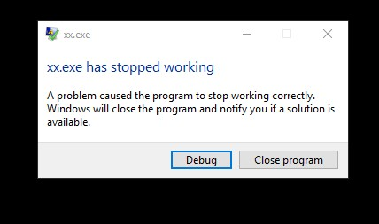
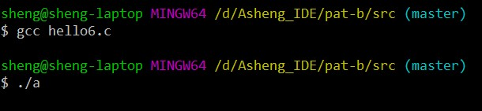
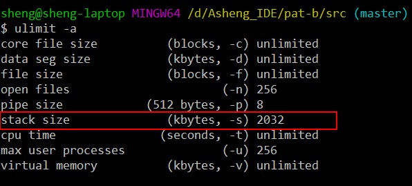
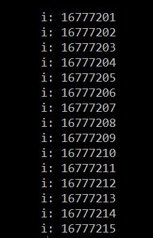

# C语言可以分配的最大内存

## 前言

最近用C刷PAT算法题目, 发现C语言有太多需要关注大小范围的东西必须  
知道, 虽说挺麻烦, 但也挺有意思.

## int最大值是多少

首先就是`int`类型的取值范围, 这个太常用. C语言标准规定最低范围是  
[-2^16 + 1, 2^16], 即[-65535, 65536], 但这个明显已经过时, 目前  
绝大部分机器支持的`int`范围是[-2^32 + 1, 2^32], 也就是**正负20个亿**  
左右, 因此大家刷题的时候只要整数范围是在20亿这个量级, 就可以大胆的  
使用`int`, 不必动用`long int`, `long long int`等. 更多关于C语言  
自带数据类型极限, 以及在自己本地测试数据类型极限, 可以访问
[这里](http://zh.cppreference.com/w/c/types/limits)

## 1000万的整型数组能不能运行

如果我们直接在C程序main函数中开个1000万的整型数组, 运行这个程序会发生  
什么 ?

```c
#include <stdio.h>

int main() {
    int arr[10000000]; // 1000万
    arr[400] = 123;
    printf("%d\n", arr[400]);
    return 0;
}
```

在win10_64位 CodeBlock 16.01下运行结果:  



在win10_64位 gcc6.3.0(MinGW)命令行编译运行结果:



可以看到, 在IDE中运行程序直接崩溃, 在命令行中什么也没输出,  
总之就是程序运行不正常, 可以理解为内存爆掉了. 难道C语言连  
1000万的整型数组都开不出来吗? 

举个例子:若果大家经常刷算法题应该有这个经验很多时候用一个  
非常大的数组解题会显著提高效率, 非常方便. 比如输入100万  
个数, 每个数都不大于10万, 然后任意给你一个数, 问你这个数存  
不存在, 也就是查找, 若果按照传统的方法就算用C语言自带的2分  
查找法, 每次在100万个数据中找出一个数, 工作量依旧非常巨大,   
而且效率低下, 而直接把输入的数据当数组下标开个10万的数组解决,  
问题则非常简单. 说到这里相信懂的人已经懂了, 如果不知所云也没  
关系, 继续刷题, 以后回过头来看.

## 当我们谈C语言内存的时候我们再谈什么

大家可能都能听过什么栈内存, 堆内存, 什么堆栈, 静态内存, 动态内存  
等等, 一些概念, 乍一看一脸懵逼, 这些都什么玩意, 我们现在先不关注  
概念的东西, 直接看实际需求.

上面我们已经提到, 在main函数中开个1000万的整型, 程序就爆掉了, 那  
到底, 最大能开多大的容量的整型数组, 才能不爆掉呢. 首先我们先来一波  
计算, 大部分机器`sizeof(int)`得到的值是**4**, 也就是一个整型数据  
需要4个字节的容量, 1000万个整型数组需要`4 * 10000000 / 1024 / 1024`,  
计算结果大约是**38M**

> 1G = 1024M, 1M = 1024K, 1K = 1024byte(字节)

在Linux或者是在windows下的mingw环境下, 可以输入命令`ulimit -a`, 查看  
C语言内存分配情况, 在下图我的机器上可以看到`stack size`大约为2M  



按照一个整型数据占4个字节来算, 2M内存用来开数组, 最大也就开个52万左右,  
我们的测试开了1000万, 显然是要爆掉的. 那么问题来了, 难道我们的C语言,  
就TM只能提供区区50来万的数组空间吗? 别说50万, 就是1千万, 也不一定完全  
够用呀. 当然不是, 上面只是C语言分配内存的默认方法, 也是最简单的方法,  
这种方法用的是栈内存, 而C语言能提供的栈内存非常有限, 顶天就那么几M,  
如果需要拿到更大的内存空间, 就不能使用这种方法了.

> 若果大家觉得52万, 貌似已经够自己用了, 我只能说, 兄弟再刷两题看看
> 栈和堆栈意思一样, 堆是另一种数据结构

## 我就是需要需要很大的内存空间怎么办

第1种方法: 使用`malloc`

这种方法我在这里不展开细说了, 如果大家对`malloc`很熟的话, 我这么  
一提大家应该就明白了. 最简单的用法就是用malloc分配数组空间

```c
#include <stdio.h>
#include <stdlib.h>

int main() {
    int *arr;
    arr = (int*)malloc(10000000 * sizeof(int));
    arr[400] = 200;
    printf("%d\n", arr[400]); // 正常输出 200
    free(arr);
    return 0;
}

```

第2种方法: 把变量声明放到文件作用域中(或者叫全局作用域)

这种方法重点推荐使用, 简单粗暴非常方便, 什么叫文件作用域就是把  
变量声明挪到所有函数之外, 也就是main函数的上面即可. 源代码几乎  
不用作任何改动, 直接把大数据变量声明搬到main函数上面即可.

```c
#include <stdio.h>
#define LEN 24

long long int arr[1 << LEN]; // 声明放到这里就对啦

int main() {
    for (long long int i = 0; i < (1 << LEN); i++) {
        arr[i] = i + 200;
        printf("i: %d\n", i);
    }
    return 0;
}

```

`1 << 24`相当于1000000000000000000000000(24个0), 也就是2^24 = 16777216  
下面是我机器的运行结果, 注意运行时间可能会非常长



可以看到, 即便是开出1600万, 这么大的数组, 程序依旧能够正常运行.

## 总结

C语言的内存分配模式大致分为3种

1) 自动分配. 也就是写在main函数或其它函数里面的, 使用的是栈内存,  
   一般栈内存只有几M, 所以这种方法, 分配的整型数组空间可能只有  
   几十万, 一般建议刷算法题的时候, 超过10万就不用这种方法
2) 使用malloc分配, 可以分配的很大, 一般是几个G
3) 把声明放在全局作用域中, 可以分配的很大, 一般是几个G

## 参考

[【C语言编程】五大内存分区](https://www.douban.com/note/284356322/?qq-pf-to=pcqq.group)

[warning: left shift count >= width of type](https://stackoverflow.com/questions/4201301/warning-left-shift-count-width-of-type)

[转：C语言申请内存时堆栈大小限制](https://www.cnblogs.com/yfz0/p/5830439.html)

C Primee Plus 第6版 中文版 2016.4出版 Stephen Prata著 姜佑译 
