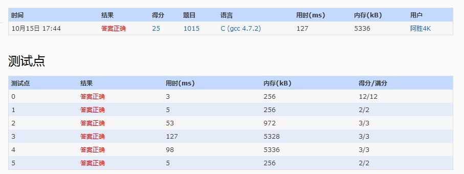
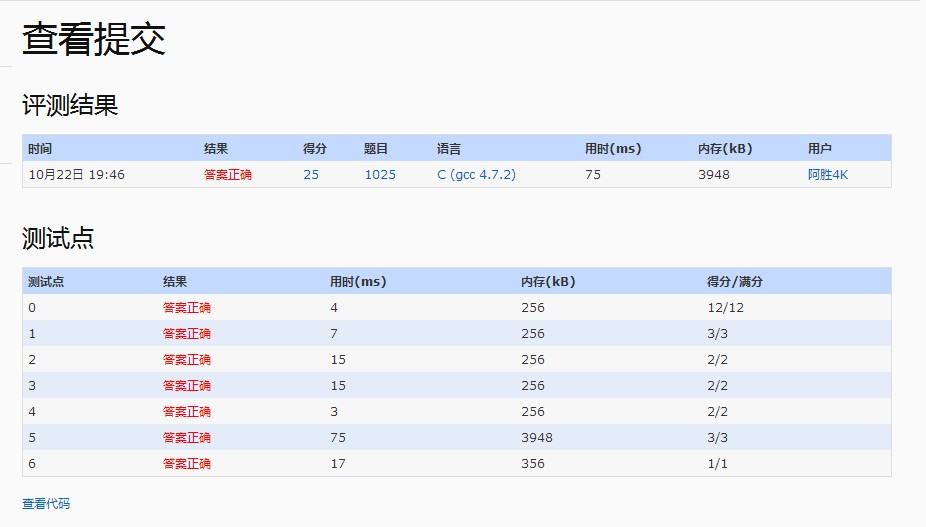

# 基本信息

练习地址: https://www.patest.cn/contests/pat-b-practise  
下面的代码全部使用, C语言实现.

https://www.patest.cn/contests/pat-b-practise/ranklist?page=113
20171015 第5605名


# 1001. 害死人不偿命的(3n+1)猜想 (15)

原题: https://www.patest.cn/contests/pat-b-practise/1001

实现代码:

```c
#include <stdio.h>;

int main() {
    int n;
    int step = 0;
    scanf("%d", &n);
    while (n != 1) {
        if (n % 2 == 0) {
            n = n / 2;
            step++;
        } else {
            n = ((3 * n) + 1) / 2;
            step++;
        }
    }
    printf("%d", step);
    return 0;
}
```

# 1002. 写出这个数 (20)

原题: https://www.patest.cn/contests/pat-b-practise/1002
参考: http://www.cnblogs.com/geyang/p/6243512.html

实现思路:  
按照题目要求: 自然数`n < 10^100`, 则可知所求的和`sum < 900`, 也就是和  
最多只能是三位数.  
利用C语言提供的`getchar()`, 每次读入一个数并计算和. 求出和记录在`sum`中.  
利用C语言2维字符数组, 定义数字拼音字符串. 接下来利用求余数的方法, 分别拿到  
一个3位数, 百位十位个位, **各**是多少.

实现代码:

```c
#include <stdio.h>

int main () {
    char ch;
    int num[4]; // 数组下标0, 不用
    int sum = 0;
    int i;
    char pinyin[10][20] = {
        "ling",
        "yi",
        "er",
        "san",
        "si",
        "wu",
        "liu",
        "qi",
        "ba",
        "jiu"
    };

    while ((ch = getchar()) != '\n') {
      	// 拿到这个数本身, 不要这个数的ASCII码
        sum += ((int)(ch) - (int)('0'));
    }
    intToArray(num, sum);

    if (num[1] == 0 && num[2] == 0) {
        printf("%s\n", pinyin[num[3]]);
    } else if (num[1] ==0 && num[2] != 0) {
        printf("%s %s\n", pinyin[num[2]], pinyin[num[3]]);
    } else {
        printf("%s %s %s\n", pinyin[num[1]], pinyin[num[2]], pinyin[num[3]]);
    }

    return 0;
}

// 整型转数组
// 参数: arr[]存放转好的数, x要转的数, x范围[0, 900)
void intToArray (int arr[], int x) {
    int m1; // 百位余数
    int m2; // 十位余数
    int m3; // 各位余数
    m1 = (int)(x / 100);
    m2 = (int)(x / 10) % 10;
    m3 = x % 10;
    arr[0] = 0; // 占个坑位
    arr[1] = m1; // printf("%d\n", arr[1]);
    arr[2] = m2; // printf("%d\n", arr[2]);
    arr[3] = m3; // printf("%d\n", arr[3]);
    // m1, m2, m3的合法取值是[0, 9]
}

/*
    测试用例:
    输入: 123456789
    输出: si wu

    输入: 123
    输出: liu
*/
```

# 1003. 我要通过！(20)

原题: https://www.patest.cn/contests/pat-b-practise/1003    

实现思路:  
形如`aPbTc`, 输出答案正确.  
a可以是0个或多个A  
b可以是1个或多个A  
c可以是0个或多个A  
假设a, b, c分别包含x, y, z个A, 则必须必须满足`x * z = y`  

完整代码:

```c
#include <stdio.h>

int isPATString (char *str);

int main () {
    char pstr[120];
    int n;
    int isPAT;
    scanf("%d", &n);

    while (n) {
        scanf("%s", pstr);
        isPAT = isPATString(pstr);
        if (isPAT == 1) {
            printf("YES\n");
        } else if (isPAT == 0) {
            printf("NO\n");
        }
        n--;
    }
    return 0;
}

int isPATString (char *str) {
    char *ph = str; // 指向字符串第1位
    char *pp; // 指向P
    char *pt; // 指向T
    int a = 0;
    int b = 0;
    int c = 0;

    // 先确定字符串中, 只含有PAT这三个字符
    while (*str != '\0') {
        if (*str == 'A') {
            // do nothing
        } else if (*str == 'P') {
            pp = str;
        } else if (*str == 'T') {
            pt = str;
        } else {
            return 0;
        }
        str++;
    }
    // 根据题目描述, P在左T在右, 并且中间至少有一个A
    if (!(pp+1 < pt)) {
        return 0;
    }

    while (*ph != '\0') {
        if (ph < pp) {
            a++;
        } else if (pp < ph && ph < pt) {
            b++;
        } else if (ph > pt) {
            c++;
        }
        ph++;
    }
    if (a*b == c) {
        return 1;
    } else {
        return 0;
    }
}

```

# 1004. 成绩排名 (20)

原题: https://www.patest.cn/contests/pat-b-practise/1004

实现思路: 利用结构体定义学生信息, 简单循环即可实现功能. 注意, 本题最好不要使用  
结构指针.

完整代码:

```c
#include <stdio.h>

struct student {
    char name[20];
    char no[20];
    int score;
};
typedef struct student s_student; // 最好别用结构指针, 否则老麻烦了

int main () {
    s_student high; // 最高的学生
    s_student low;  // 最低分学生
    s_student temp; // 遍历学生信息, 临时用
    int n;

    scanf("%d", &n);
    scanf("%s %s %d", high.name, high.no, &high.score);
    low = high; // 第一个数据, 作为初始值
    n--;

    while (n) {
        scanf("%s %s %d", temp.name, temp.no, &temp.score);
        if (high.score < temp.score) {
            high = temp;
        }
        if (low.score > temp.score) {
            low = temp;
        }
        n--;
    }

    printf("%s %s\n", high.name, high.no);
    printf("%s %s\n", low.name, low.no);
    return 0;
}

/*
输入:
3
Joe Math990112 89
Mike CS991301 100
Mary EE990830 95

输出:
Mike CS991301
Joe Math990112
*/

```

# 1005. 继续(3n+1)猜想 (25)

原题: https://www.patest.cn/contests/pat-b-practise/1005

实现思路:
本题建议采用链表作为存储结构. 先把读进来的序列存入链表中, 然后遍历链表,  
从第一个数开始计算"猜想数", 之后找到这个猜想数, 并把它从链表中删除.  

完整代码:

```c
#include <stdio.h>
#include <stdlib.h>
#include <time.h>

struct list {
    int data;
    struct list *next;
};
typedef struct list s_list;
typedef struct list *p_list;

void readList (p_list p, int n); // 为p随机赋n个值
void printList (p_list phead);   // 打印phead
void del (p_list p, int pos);    // 删除p中第pos个节点
void swap (int *x, int *y);      // 交换两个变量的值
int getLength (p_list p);        // 得到p的长度
void order (p_list p);           // 对p进行排序
int search (p_list p, int x);    // 查找, 返回找到的位置

/*
输入:
6
3 5 6 7 8 11
输出:
7 6

输入:
10
88 55 2 10 3 5 6 7 8 11
输出:
88 55 7 6
*/

int main () {
    int n;      // 链表初始值个数
    int gusNum; // 临时存放"猜想数"
    int pos;    // 要删的数位置
    p_list head = (s_list*)malloc(sizeof(s_list));
    p_list ptr = (s_list*)malloc(sizeof(s_list)); // 遍历用
    head->next = NULL;

    scanf("%d", &n);
    readList(head, n);
    ptr = head->next;  // 指向第一个节点
    while (ptr != NULL) {
        gusNum = ptr->data;
        while (gusNum != 1) {
            if (gusNum % 2 == 0) {
                gusNum = gusNum / 2;
            } else {
                gusNum = ((3 * gusNum) + 1) / 2;
            }
            pos = search(head, gusNum);
            // 如果pos大于0, 说明序列中这个数被覆盖了, 直接拿掉
            if (pos > 0) {
                del(head, pos);
            }
        }
        ptr = ptr->next;
    }

    order(head);
    printList(head);

    return 0;
}

// 参数: p为链表头结点, n是需要赋值的个数
void readList (p_list p, int n) {
    p_list temp;
    while (n) {
        temp = (s_list*)malloc(sizeof(s_list));
        scanf("%d", &temp->data);
        temp->next = p->next;
        p->next = temp;
        n--;
    }
}

// 参数: phead为链表的头结点
void printList (p_list phead) {
    p_list p;
    p = phead->next;
    while (p != NULL) {
        // 最后一个字符, 不输出空格, 而是直接换行
        if (p->next == NULL) {
            printf("%d\n", p->data);
        } else {
            printf("%d ", p->data);
        }
        p = p->next;
    }
}

// 删除操作
// 参数: p是要删除链表的头结点, pos是删除的位置
void del (p_list p, int pos) {
    p_list pre = (s_list*)malloc(sizeof(s_list)); // 要删节点的前一个
    p_list cur = (s_list*)malloc(sizeof(s_list)); // 要删的节点
    int count = 1;
    pre = p;

    while (count < pos) {
        pre = pre->next;
        count++;
    }
    cur = pre->next;
    pre->next = cur->next;
    free(cur);
}

void swap (int *x, int *y) {
    int temp;
    temp = *x;
    *x = *y;
    *y = temp;
}

// 对链表进行从大到小排序
// 参数: p要排序的链表
void order (p_list p) {
    p_list temp = (s_list*)malloc(sizeof(s_list));
    int n = getLength(p); // 链表长度
    int i;
    int j;

    /*  假如n=5, 也就是单链表中有5个元素需要排序
        通过分析, 我们需要的是双层循环. 我需要变量像下面这样变化
        i = 4, j = 4
        i = 4, j = 3
        i = 4, j = 2
        i = 4, j = 1

        i = 3, j = 3
        i = 3, j = 2
        i = 3, j = 1

        i = 2, j = 2
        i = 2, j = 1

        i = 1, j = 1
        我下面的循环, 就是为了实现如上所述的效果.
    */
    n = n - 1;
    for (i=n; i>=1; i--) {
        temp = p->next;
        for (j=i; j>=1; j--) {
            // printf("i = %d, j = %d\n", i ,j);
            if (temp->data < temp->next->data) {
                swap(&temp->data, &temp->next->data);
            }
            temp = temp->next;
        }
    }
}

// 得到链表的 长度
int getLength (p_list p) {
    p_list temp = (s_list*)malloc(sizeof(s_list));
    int length = 0;
    temp = p->next;
    while (temp) {
        temp = temp->next;
        length++;
    }
    return length;
}

// 查找元素在单链表中的位置
// 参数: p待查找的链表, x要查找的值
// 返回值: 找到返回在链表中第一次出现的位置
int search (p_list p, int x) {
    p_list temp = (s_list*)malloc(sizeof(s_list));
    int index = 1;
    temp = p->next;

    while (temp != NULL) {
        if (temp->data == x) {
            return index;
        }
        index++;
        temp = temp->next;
    }

    return -1;
}

```

# 1006. 换个格式输出整数 (15)

原题: https://www.patest.cn/contests/pat-b-practise/1006

实现思路:  
读入的n有三种情况, 3位数, 2位数, 1位数, 分别判断, 输出即可.

完整代码:

```c
#include <stdio.h>

void printChar (int times, char ch);
void printInt (int times);

int main () {
    int n;
    int i;
    int m1; // 百位
    int m2; // 十位
    int m3; // 各位
    scanf("%d", &n);

    if (n < 10) {
        printInt(n);
        printf("\n");
    } else if (n >= 100) {
        m1 = (int)(n / 100);
        m2 = ((int)(n / 10)) % 10;
        m3 = n % 10;
        printChar(m1, 'B');
        printChar(m2, 'S');
        printInt(m3);
        printf("\n");
    } else {
        m2 = (int)(n / 10);
        m3 = n % 10;
        printChar(m2, 'S');
        printInt(m3);
    }

    return 0;
}

// 参数: times打印多少次, 需要打印的字符
void printChar (int times, char ch) {
    int i;
    for (i=1; i<=times; i++) {
        printf("%c", ch);
    }
}

void printInt (int times) {
    int i;
    for (i=1; i<=times; i++) {
        printf("%d", i);
    }
}

```

# 1007. 素数对猜想 (20)

原题: https://www.patest.cn/contests/pat-b-practise/1007

关于素数判断C语言实现请参考:  
http://www.cnblogs.com/asheng2016/p/7647278.html

分析题意: 题目是让我们得出`[2, n]`中所有的素数对个数, 例如`2 3 5 7 11 13 17 19`,  
那么输出`4`.

实现思路: 比较直接的方法就是先把`[2, n]`所有的素数拿出来, 单门放到另一个数组中, 然后  
两两循环判断差值是否为2, 从而确定有多少个素数对.  
第2种方法是, 每次把当前素数的值保存下来, 等循环到下个素数时, 作差值比较是否等于2, 从而  
确定一个素数对. 下面的代码使用第2种方法实现.

完整代码:

```c
#include <stdio.h>

int isPrime (int n);

int main () {
    int pre = 3; // 保存前一个素数的值
    int result = 0; // 素数对个数
    int i;
    int n;

    scanf("%d", &n); // 输入的n若果小于5, 直接返回0, 这是我们人工判断
    for (i=5; i<=n; i++) {
        if (isPrime(i) == 1) {
            if ((i - pre) == 2) {
                result += 1;
            }
            pre = i; // 只要当前的i为素数, 我们就更新pre的值
        }
    }
    printf("%d\n", result);

    return 0;
}

// 是返回1, 不是返回0
int isPrime (int n) {
    int i = 2;
    int flag = 1; // 默认n是素数
    while (i * i <= n) {
        if (n % i == 0) {
            flag = 0;
            break;
        }
        i++;
    }
    return flag;
}

```

# 1008. 数组元素循环右移问题 (20)

原题: https://www.patest.cn/contests/pat-b-practise/1008

题意理解: 假设`n=6`, 需要移位的序列是: `1 2 3 4 5 6`, 如果`m=2`, 从6开始看, 把6
移动2个位置,  6就到了2的位置, 同样把5移动2个位置, 5就到了1的位置, 依次类推. 
下面考虑一些特殊情况:  
当`m=0`, 很显然原序列不进行任何移动  
当`m=6`, 把6移动6个位置, 结果仍然是原序列  
当`m=7`, 现在`m>n`, 根据题意这种情况是可能的, 把6往右移动7个位置, 我们发现6移到了1的位置.  
总结以上分析, 可以得出, 移动的次数`m = m % n`

解题思路: 本题有多种解法, 但不少方法感觉不太道义或不太合理.  
第1种, 不管题目要求, 直接使用2个数组.  
第2种, 利用C语言特性, 通过循环一个一个读取数据, 读取一个数据就通过计算把这个数据放在合适  
的位置, 利用这种方法, 简直可以实现数据"0"移动  
第3种, 不进行数据移动, 而是控制打印顺序. 这个很好理解, 比如6个数, [1 2 3 4 5 6], m=2,  
也就是全体往右移动2个位置, 我们可以先打印`5 6`, 再打印`1 2 3 4`  
第4种, 使用链表实现, 这个方法感觉比较合理(下有详细解释)  
第5种, 使用数组模拟链表实现, 用链表实现代码量可能很长, 用数组模拟链表很简单, 声明一个空间  
较大的数组, 然后从数组的中间开始存数据, 这样涉及到移动数据时, 只需把后面的数据插在前面即可.  
这种方法缺点很明显, 就是占用空间可能比较大, 但就解本题来说, 是完全可以的.  
第6种, 如果必须限定只能使用数组, 数组大小只能等于n. 可以利用移位算法来实现, 这种方法比较难  
理解, 我在网上看到有大牛实现了, 可以参考这里:  
http://blog.csdn.net/xtzmm1215/article/details/38407799  

第3种实现方法, 控制打印顺序, 完整实现代码:

```c
#include <stdio.h>

int main () {
    int i;
    int n;
    int m;
    char ch = ' '; // 打印控制变量, 默认空格
    int arr[100];  // 下标0, 不存数据

    scanf("%d", &n);
    scanf("%d", &m);
    m = m % n; // 确保 m < n

    // 给数组赋值
    for (i=1; i<=n; i++) {
        scanf("%d", &arr[i]);
    }

    // 接下来分两次, 分别控制打印顺序
    // 第1次打印, 从倒数第m个数开始
    for (i=n-m+1; i<=n; i++) {
        printf("%d ", arr[i]);
    }

    // 第2次打印, 从1到倒数第m个数
    for (i=1; i<=n-m; i++) {
        if (i == (n - m)) {
            ch = '\n';
        }
        printf("%d%c", arr[i], ch);
    }

    return 0;
}

```

## 链表实现

使用链表实现, 根据题意至少需要实现链表的插入, 删除, 定位操作.  
一般情况下, 大部分操作都是把链表后面的元素拿到前面, 如果真的追求最少的移动次数,  
可以添加判断条件, 从而有些情况需要把链表前面的元素移动到后面.  
我们这里为了简单, 插入只有2种情况一种是在头部插入一种是在尾部插入.  
由于我们结构体只有一个数据域data, 所以在执行删除(在题目里面相当于移动)操作时, 只要  
事先保存着数据域的值, 就可以把该节点彻底从链表中移除(free)

完整实现代码:

```c
#include <stdio.h>

struct list {
    int data;
    struct list *next;
};
typedef struct list s_list;
typedef struct list *p_list;

p_list insert (p_list p, int x);
void print (p_list head);
int del (p_list head, p_list *rear);


int main () {
    int i;
    int n;        // 链表元素个数
    int m;        // 右移位数
    int x;        // 当前读取的数
    p_list head;  // 头指针
    p_list rear;  // 尾指针

    head = (s_list*)malloc(sizeof(s_list));
    head->next = NULL;
    rear = head;
    scanf("%d", &n);
    scanf("%d", &m);
    m = m % n;

    // 为链表赋值
    for (i=1; i<=n; i++) {
        scanf("%d", &x);
        rear = insert(rear, x); // 动态修改尾指针的指向
    }

    // 对链表进行移动
    for (i=1; i<=m; i++) {
        x = del(head, &rear);
        insert(head, x);
    }
    print(head);

    return 0;
}

// 在p元素的后面插入一个元素x
// 返回值: 返回一个指向被删元素的指针
p_list insert (p_list p, int x) {
    p_list temp = (s_list*)malloc(sizeof(s_list));
    temp->data = x;
    temp->next = p->next;
    p->next = temp;
    return temp;
}

// 删除一个尾元素, 并返回其值
// 把链表元素的一个节点整个从程序中移除并无大碍, 只要被删元素
// 的值, 被保存下来, 以后随时可以重建被删节点
// 该函数需要在内部改变rear的指向, 因此需要定义指针的指针
int del (p_list head, p_list *rear) {
    p_list pre;      // 最后一个元素的前一个元素
    p_list tempRear; // 指向被删元素, 也就是最后一个元素
    int value;       // 被删除元素的值

    value = (*rear)->data; // 又是运算符优先级的坑
    tempRear = *rear;
    pre = head->next;
    while (pre->next != *rear) {
        pre = pre->next;
    }
    *rear = pre;
    (*rear)->next = NULL;
    free(tempRear);

    return value;
}

// 打印链表
void print (p_list head) {
    p_list p;
    char ch = ' '; // 打印控制变量

    p = head->next;
    while (p != NULL) {
        if (p->next == NULL) {
            ch = '\n';
        }
        printf("%d%c", p->data, ch);
        p = p->next;
    }
}

```

# 1009. 说反话 (20)

原题: https://www.patest.cn/contests/pat-b-practise/1009

题意理解: 输入的开头有可能有空格, 输出的末尾经过我测试也可以有多余的空格.

实现思路: 本题如果用语言内置分割函数实现非常简单, 但是那样做显然不符合道义.  
下面我用C语言实现, 不使用任何内置函数.  
总体思路就是, 手动按照空格拆分字符串, 最后倒序输出.  

完整实现:

```c
#include <stdio.h>

// input: Hello World Here I Come
// output: Come I Here World Hello

int getLength (char *str);

int main () {
    int i;
    int j = 0;              // 添加分割字符串用
    char ch = ' ';          // 打印控制变量
    char source[100];       // 原字符串
    char result[80][80];    // 分割后的字符串数组
    int slen;               // 原字符串长度
    int rlen = 0;           // 字符串数组一维最后下标

    gets(source);
    slen = getLength(source);
    for (i=0; i<slen; i++) {
        if (source[i] != ' ') {
            result[rlen][j] = source[i];
            j++;
        }
        // 当遇到空格时, 切换到下个下标
        // 若果开头有多个空格, 那么这里直接会存一个结束标志
        // 开头有多个空格, 只会影响输出的末尾多输出空格
        // 对题目答案没有影响, 我就没有做特殊处理
        // 本题在PAT测试上, 为满分通过
        if (source[i] == ' ') {
            result[rlen][j] = '\0';
            rlen++;
            j = 0;
        }
        // 手动为最后一个字符串添加结束标志
        if (source[i + 1] == '\0') {
            result[rlen][j] = '\0';
        }
    }

    for (i=rlen; i>=0; i--) {
        if (i == 0) {
            ch = '\n';
        }
        printf("%s%c", result[i], ch);
    }

    return 0;
}

int getLength (char *str) {
    int i = 0;
    while (*str != '\0') {
        i++;
        str++;
    }
    return i;
}

```

# 1010. 一元多项式求导 (25)

原题: https://www.patest.cn/contests/pat-b-practise/1010

实现思路: 首先多项式的存储直接用数组, 读数的时候需注意, 按照题目的描述  
我们需要, 当输入为'\n'时结束读数, 所以这里需要用到`getchar`, 求导比较简单  
i每次循环加2, 按照要求存放即可. 

```c
#include <stdio.h>

// input: 3 4 -5 2 6 1 -2 0
// output: 12 3 -10 1 6 0

int main () {
    int source[1100];     // 原多项式, 下标0不存东西
    int res[1100];        // 结果多相似, 下标0不存东西
    int slen = 0;         // 原多项式长度, 指向最后一个元素
    int rlen = 0;         // 结果多项式长度, 指向最后一个元素
    int si = 1;
    int ri = 1;
    int i;
    char isEnter = 'x';   // 初始任意非\n字符, 靠它实现, 按回车结束循环
    char ch = ' ';        // 打印控制字符

    // 读数
    while (isEnter != '\n') {
        scanf("%d", &source[si]);
        slen = slen + 1;
        si = si + 1;
        isEnter = getchar();
    }

    // 求导
    // 指数为0, 该项直接不用看了
    // 因为题目中说了, 输入是按照指数递降的方式, 那么
    // 常数项, 只可能在最后, 所以首先检查下最后一项是不是0,
    // 如果是0, 直接删掉, 也就是长度-2
    if (source[slen] == 0) {
        slen = slen - 2;
    }
    // 根据题目的含义, 输入不可能出现0 0, 但输出可能会出现
    if (slen == 0) {
        printf("0 0\n");
    }
    // 循环每次+2
    for (i=1; i<=slen; i+=2) {
        res[ri] = source[i] * source[i + 1]; // 系数
        ri = ri + 1;
        res[ri] = source[i + 1] - 1;   // 指数
        ri = ri + 1;
        rlen = rlen + 2; // 指数和系数都添加一次, 总长+2
    }

    for (i=1; i<=rlen; i++) {
        if (i == rlen) {
            ch = '\n';
        }
        printf("%d%c", res[i], ch);
    }

    return 0;
}

```

# 1011. A+B和C (15)

原题: https://www.patest.cn/contests/pat-b-practise/1011

题目本身非常简单, 但有个小坑. 就是需要使用`long int`, 而且看样子PAT提供的   
编译器(gcc4.7.2), 使用scanf获取`long int`的值时, 需要使用`%ld`

完整实现:

```c
#include <stdio.h>

int main () {
    int t;
    long int a;
    long int b;
    long int c;
    int i = 0;

    scanf("%d", &t);
    while (t != 0) {
        scanf("%ld", &a);
        scanf("%ld", &b);
        scanf("%ld", &c);
        i = i + 1;
        if (a + b > c) {
            printf("Case #%d: true\n", i);
        } else {
            printf("Case #%d: false\n", i);
        }
        t = t - 1;
    }
    return 0;
}

/*
input:
4
1 2 3
2 3 4
2147483647 0 2147483646
0 -2147483648 -2147483647

output:
Case #1: false
Case #2: true
Case #3: true
Case #4: false

*/

```

# 1012. 数字分类 (20)

原题: https://www.patest.cn/contests/pat-b-practise/1012

完整实现:

```c
#include <stdio.h>

int main () {
    int a1 = 0;
    int a2 = 0;
    int a3 = 0;
    float a4 = 0.0; // a4是浮点数
    int a5 = 0;
    int flag1 = 0; // 相应的数字是否存在判断
    int flag2 = 0;
    int flag3 = 0;
    int flag4 = 0;
    int flag5 = 0;
    int time2 = 1; // 判断a2用, 奇数正号, 偶数负号
    int time4 = 0; // 记录满足a4条件的个数, 用来求平均数
    int sum4 = 0; // 保存满足a4条件的和
    int n; // 数字总数
    int i;
    int now;

    scanf("%d", &n);
    while (n != 0) {
        scanf("%d", &now);

        // A1
        if (now % 5 == 0 && now % 2 == 0) {
            flag1 = 1;
            a1 += now;
        }

        // A2
        if (now % 5 == 1) {
            flag2 = 1;
            // now是偶数, 则取负号
            if (time2 % 2 == 0) {
                now = -now;
            }
            time2++;
            a2 += now;
        }

        // A3
        if (now % 5 == 2) {
            flag3 = 1;
            a3 = a3 + 1;
        }

        // A4
        if (now % 5 == 3) {
            flag4 = 1;
            time4 += 1;
            sum4 += now;
        }
        a4 = (float)(sum4) / (float)(time4);

        // A5
        if (now % 5 == 4) {
            flag5 = 1;
            if (now > a5) {
                a5 = now;
            }
        }

        n = n-1;
    }

    if (flag1 == 0) {
        printf("N ");
    } else {
        printf("%d ", a1);
    }

    if (flag2 == 0) {
        printf("N ");
    } else {
        printf("%d ", a2);
    }

    if (flag3 == 0) {
        printf("N ");
    } else {
        printf("%d ", a3);
    }

    if (flag4 == 0) {
        printf("N ");
    } else {
        printf("%.1f ", a4);
    }

    if (flag5 == 0) {
        printf("N\n");
    } else {
        printf("%d\n", a5);
    }

    return 0;
}

```

# 1013. 数素数 (20)

原题: https://www.patest.cn/contests/pat-b-practise/1013

实现思路: 实现构建一个1万空间的数组, 里面存放前1万个素数, 之后正常输出即可.  
核心还是, 怎么判断一个数是不是素数.  

完整实现: 

```c
#include <stdio.h>

#define MAXSIZE 10001
int isPrime (int n);

/*
input:
5 27
output:
11 13 17 19 23 29 31 37 41 43
47 53 59 61 67 71 73 79 83 89
97 101 103
*/
int main () {
    int m;
    int n;
    int prime[MAXSIZE]; // 1-10000共保存1万个素数, 下标0不用
    int i = 2;
    int j = 1;
    int split = 10;    // 每10个字符打印一个换行
    char ch = ' ';     // 打印控制字符

    scanf("%d", &m);
    scanf("%d", &n);

    while (i) {
        if (isPrime(i) == 1) {
            prime[j] = i;
            j++;
        }
        if (j == MAXSIZE) {
            // 1万个素数, 准备完毕
            break;
        }
        i++;
    }

    j = 0; // 现在j用来, 打印控制
    for (i=m; i<=n; i++) {
        j++;
        if (j % split == 0) {
            ch = '\n';
        } else {
            ch = ' ';
        }
        // 最后一个数也是\n
        if (i == n) {
            ch = '\n';
        }
        printf("%d%c", prime[i], ch);
    }

    return 0;
}

// 是返回1, 不是返回0
int isPrime (int n) {
    int i = 2;
    int flag = 1;
    while (i * i <= n) {
        if (n % i ==0 ) {
            flag = 0;
            break;
        }
        i++;
    }
    return flag;
}

```

# 1014. 福尔摩斯的约会 (20)

原题: https://www.patest.cn/contests/pat-b-practise/1014

题意理解: 题目中关键的就3句话, 并且题目保证输入有唯一解, 因此我们不考虑特殊情况.  
(1) 因为前面两字符串中第1对相同的大写英文字母（大小写有区分）是第4个字母'D'，代表星期四  
这句话说明, 前两个字符串开头一定会出现一对相等的**大写字母**, 而且必须在A-G之间  
(2) 第2对相同的字符是'E'，那是第5个英文字母，代表一天里的第14个钟头  
这句话说明第2次出现的相等的字符必定在0-9, A-N之间, 字母必须**大写**  
(3) 后面两字符串第1对相同的英文字母's'出现在第4个位置（从0开始计数）上，代表第4分钟    
这句话说明后两个字符串, 第一次相等的时候一定是个大写或小写字母, 根据出现的位置, 判断  
分钟, 范围是0-59    

实现思路: 首先4行分别保存在4个字符数组里, 然后按照要求进行响应的遍历. 注意及时使用`break`  
不要做多余的判断, 否则可能会出现某些问题. 结果字符串每一位都是固定的, 直接写死处理即可.

完整实现:

```c
#include <stdio.h>

// res[10]存放说明
// 0 1 2, 星期
// 3, 空格
// 4 5, 小时
// 6, :
// 7 8, 分钟
// 9, '\0'

void getDay (char str[], char ch);
void getHour (char res[10], int posHour);
void getMinute (char res[10], int minute);

int main () {
    char hours[24] = {
        '0', '1', '2', '3', '4', '5',
        '6', '7', '8', '9', 'A', 'B',
        'C', 'D', 'E', 'F', 'G', 'H',
        'I', 'J', 'K', 'L', 'M', 'N'
    }; // 0点至23点
    char line1[61];
    char line2[61];
    char line3[61];
    char line4[61];
    char res[10];       // 结果字符串
    int posDay;         // 前两个字符串, 第1次相等的下标
    int posHour;        // 前两个字符串, 第2次相等的下标
    int dayFlag = 0;    // 0表示posDay没值
    int minute;         // 存放分钟
    int i = 0;

    scanf("%s", line1);
    scanf("%s", line2);
    scanf("%s", line3);
    scanf("%s", line4);

    // 遍历前两个字符串, 解出星期和小时
    while (i < 60) {
        if (dayFlag == 0) {
            // 星期是大写字母A-G
            if (line1[i] >= 'A' && line1[i] <= 'G') {
                // 第1次大写字母相等
                if (line1[i] == line2[i]) {
                    posDay = i;
                    dayFlag = 1;
                    //printf("1 %c\n", line1[i]);
                }
            }
        } else {
            // 小时可能是数字或大写字母A-N
            if (   (line2[i] >= 'A' && line2[i] <= 'N')
                || (line2[i] >= '0' && line2[i] <= '9') ) {
                if (line1[i] == line2[i]) {
                    posHour = i;
                    //printf("2 %c\n", line1[i]);
                    break;
                }
            }
        }
        i++;
    }

    // 小时字符转数字
    for (i=0; i<24; i++) {
        if (hours[i] == line1[posHour]) {
            posHour = i;
            break;  // 这个break异常关键, 卡了我2小时
            // fuck beautiful, 怎么看怎么觉得这儿专门
            // 做了个坑, 等着我踩呢
            // 自己做个测试, 输出 00:00, 就知道坑在哪了
        }
    }

    // 遍历后面两个字符串, 拿到分钟
    // 这个字符, 即可能是大写英文字母, 也可能是小写英文字母
    i = 0;
    while (i < 60) {
        if (   (line3[i] >= 'A' && line3[i] <= 'Z')
            || (line3[i] >= 'a' && line3[i] <= 'z')
            || (line4[i] >= 'a' && line4[i] <= 'z')
            || (line4[i] >= 'A' && line4[i] <= 'Z') ) {
            if (line3[i] == line4[i]) {
                minute = i;
                break; // 只需要第一次
            }
        }
        i++;
    }

    getDay(res, line1[posDay]);
    getHour(res, posHour);
    getMinute (res, minute);
    res[6] = ':';   // 直接写死, 没毛病
    res[9] = '\0';  // 字符串结束标志
    printf("%s\n", res);

    return 0;
}

// 功能: 添加日期的时间部分
void getDay (char str[], char ch) {
    switch (ch) {
        case 'A':
            str[0] = 'M';
            str[1] = 'O';
            str[2] = 'N';
            str[3] = ' ';
            break;
        case 'B':
            str[0] = 'T';
            str[1] = 'U';
            str[2] = 'E';
            str[3] = ' ';
            break;
        case 'C':
            str[0] = 'W';
            str[1] = 'E';
            str[2] = 'D';
            str[3] = ' ';
            break;
        case 'D':
            str[0] = 'T';
            str[1] = 'H';
            str[2] = 'U';
            str[3] = ' ';
            break;
        case 'E':
            str[0] = 'F';
            str[1] = 'R';
            str[2] = 'I';
            str[3] = ' ';
            break;
        case 'F':
            str[0] = 'S';
            str[1] = 'A';
            str[2] = 'T';
            str[3] = ' ';
            break;
        case 'G':
            str[0] = 'S';
            str[1] = 'U';
            str[2] = 'N';
            str[3] = ' ';
            break;
    }
}

// 小时数字, 转小时字符串, 并插入到结果字符串中4 ,5位置中
// 小时只可能是一位数, 或两位数
void getHour (char res[10], int posHour) {
    int m1; // 十位
    int m2; // 各位
    if (posHour <= 9) {
        res[4] = '0';
        res[5] = (char)(posHour + '0');
    } else {
        m1 = (int)(posHour / 10);
        m2 = (int)(posHour % 10);
        res[4] = (char)(m1 + '0');
        res[5] = (char)(m2 + '0');
    }
}

// 这个函数复用性不好, 可以考虑把res数组的下标
// 作为参数传进来, 以此实现和上个函数复用
void getMinute (char res[10], int minute) {
    int m1; // 十位
    int m2; // 各位
    if (minute <= 9) {
        res[7] = '0';
        res[8] = (char)(minute + '0');
    } else {
        m1 = (int)(minute / 10);
        m2 = (int)(minute % 10);
        res[7] = (char)(m1 + '0');
        res[8] = (char)(m2 + '0');
    }
}

/*
星期1 MON
星期2 TUE
星期3 WED
星期4 THU
星期5 FRI
星期6 SAT
星期日 SUN

input:
3485djDkxh4hhGE
2984akDfkkkkggEdsb
s&hgsfdk
d&Hyscvnm

output:
THU 14:04
*/

```

# 1015. 德才论 (25)

原题: https://www.patest.cn/contests/pat-b-practise/1015

题意:  
输入格式：  
输入第1行给出3个正整数，分别为:  
N（<=105），即考生总数；  
L（>=60），为录取最低分数线，即德分和才分均不低于L的考生才有资格被考虑录取；  
H（<100），为优先录取线  
1类, 德分和才分均不低于此线的被定义为“才德全尽”，此类考生按德才总分从高到低排序；  
2类, 才分不到但德分到线的一类考生属于“德胜才”，也按总分排序  
3类, 德才分均低于H，但是德分不低于才分  
4类, 其他达到最低线L的考生也按总分排序，但排在第三类考生之后。  

思路分析:  
N<=10万, 考生总数  
L>=60, 最低录取线  
H优先录取线  
假设no, rp, sk, sum, level分别表示一位考生的学号, 德分, 才分, 总分, 类别  
逐行读入考生信息, `rp < low || sk < low`的考生, 去掉.  
除了及格, 4类考生还需满足的条件是  
第1类, rp >= H && sk >= H  
第2类, rp >= H && sk < H  
第3类, rp < H && sk < H && rp >= sk 
第4类, 非以上3中情况  

读入学生信息, 根据条件分学生添加上对应的level, 之后进行一次排序.  
排序需要先看level, 再看sum, rp, no. 版本3按照这种方法实现.  

## 版本一: 直接使用冒泡排序, 会出现超时现象不能AC

```c
#include <stdio.h>
#include <stdlib.h>

struct students {
    long int no; //学号
    int rp; // 德分
    int sk; // 才分
    int sum; // 总分
};
typedef struct students s_stu;

void print (s_stu *stu, int len);
void sort (s_stu *stu, int len);
void swap (s_stu *stu, int i, int j);

int main () {
    s_stu *allStu;   // 所有达到录取线的学生信息
    s_stu *stuType1; // 第1类学生
    s_stu *stuType2; // 第2类学生
    s_stu *stuType3; // 第3类学生
    s_stu *stuType4; // 第4类学生
    int len1 = 0; // 1类学生总数
    int len2 = 0; // 2类学生总数
    int len3 = 0; // 3类学生总数
    int len4 = 0; // 4类学生总数
    int pass = 0;  // 达到最低录取线学生总数
    int total; // 考生总数
    int low; // 最低录取分数线
    int high; // 优先录取分数线
    s_stu temp; // 临时存放读入学生信息
    int i;
    int i1 = 0;
    int i2 = 0;
    int i3 = 0;
    int i4 = 0;

    scanf("%d", &total);
    scanf("%d", &low);
    scanf("%d", &high);

    // 动态学生数组内存分配
    allStu = (s_stu*)malloc(sizeof(s_stu) * (total + 1));

    // 读入学生信息, 并对学生分类
    // 按照个人编程习惯, 数组下标0, 不存东西
    for (i=1; i<=total; i++) {
        scanf("%ld", &temp.no); //学号
        scanf("%d", &temp.rp); // 德分
        scanf("%d", &temp.sk); // 才分
        temp.sum = temp.rp + temp.sk; // 总分

        // 低于最低录取线, 先排除
        if (temp.rp < low || temp.sk < low) {
            continue;
        }
        pass++;
        allStu[pass] = temp; // 所有达到录取线的学生信息
        if (temp.rp >= high && temp.sk >= high) {
        // 1类学生
            len1++;
        } else if (temp.rp >= high && temp.sk < high) {
        // 2类学生
            len2++;
        } else if (temp.rp < high && temp.sk < high
            && temp.rp >= temp.sk) {
        // 3类学生
            len3++;
        } else {
        // 4类学生
            len4++;
        }
    }

    // 动态为4种类型的学生分配空间
    // 为了节省内存只能这么麻烦了, 不然用链表的话
    // 代码量至少2倍
    stuType1 = (s_stu*)malloc(sizeof(s_stu) * (len1 + 1));
    stuType2 = (s_stu*)malloc(sizeof(s_stu) * (len2 + 1));
    stuType3 = (s_stu*)malloc(sizeof(s_stu) * (len3 + 1));
    stuType4 = (s_stu*)malloc(sizeof(s_stu) * (len4 + 1));

    // 为4类学生分别赋值
    for (i=1; i<=pass; i++) {
        if (allStu[i].rp >= high && allStu[i].sk >= high) {
        // 1类学生
            i1++;
            stuType1[i1] = allStu[i];
        } else if (allStu[i].rp >= high && allStu[i].sk < high) {
        // 2类学生
            i2++;
            stuType2[i2] = allStu[i];
        } else if (allStu[i].rp < high && allStu[i].sk < high
            && allStu[i].rp >= allStu[i].sk) {
        // 3类学生
            i3++;
            stuType3[i3] = allStu[i];
        } else {
        // 4类学生
            i4++;
            stuType4[i4] = allStu[i];
        }
    }
    free(allStu); // 达标学生信息用不上了

    // 对4类学生分别进行排序
    sort(stuType1, len1);
    sort(stuType2, len2);
    sort(stuType3, len3);
    sort(stuType4, len4);

    // 分别打印4类学生的信息
    printf("%d\n", len1 + len2 + len3 + len4);
    print(stuType1, len1);
    print(stuType2, len2);
    print(stuType3, len3);
    print(stuType4, len4);

    return 0;
}

// 打印学生信息
// 参数: stu[], 学生数组, len, 学生长度
void print (s_stu *stu, int len) {
    int i;
    if (len == 0) {
        // 根据题意, 如果该类学生为空则 do nothing
        //printf("该类型学生信息为空\n");
    } else {
        for (i=1; i<=len; i++) {
            printf("%ld %d %d\n", stu[i].no, stu[i].rp, stu[i].sk);
        }
    }
}

/*
对结构体进行排序
排序要参考3个条件
1. 总分高, 排在上面
2. 总分相等并且德分高, 排在上面
3. 总分相等并且德分也相等, 准考证号小的排在上面
参数: stu, 要排序的学生数组, len, 该类型学生的实际个数
*/
void sort (s_stu *stu, int len) {
    int i;
    int j;
    for (i=1; i<=len; i++) {
        for (j=len; j>i; j--) {
            if (stu[j].sum > stu[j-1].sum) {
                swap(stu, j, j-1);
            }
            if (stu[j].sum == stu[j-1].sum
                && stu[j].rp > stu[j-1].rp) {
                swap(stu, j, j-1);
            }
            if (stu[j].sum == stu[j-1].sum
                && stu[j].rp == stu[j-1].rp
                && stu[j].no < stu[j-1].no) {
                swap(stu, j, j-1);
            }
        }
    }
}

// 交换结构体数组
// 功能: 对stu[i] 和 stu[j] 进行交换
void swap (s_stu *stu, int i, int j) {
    s_stu temp;
    temp = stu[i];
    stu[i] = stu[j];
    stu[j] = temp;
}

/*
input:
14 60 80
10000001 64 90
10000002 90 60
10000011 85 80
10000003 85 80
10000004 80 85
10000005 82 77
10000006 83 76
10000007 90 78
10000008 75 79
10000009 59 90
10000010 88 45
10000012 80 100
10000013 90 99
10000014 66 60

output:
12
10000013 90 99
10000012 80 100
10000003 85 80
10000011 85 80
10000004 80 85

10000007 90 78
10000006 83 76
10000005 82 77
10000002 90 60

10000014 66 60

10000008 75 79
10000001 64 90
*/

```

## 版本2: 改用C语言自带的快速排序qsort, 能够AC

```c
#include <stdio.h>
#include <stdlib.h>

struct students {
    long int no; //学号
    int rp; // 德分
    int sk; // 才分
    int sum; // 总分
};
typedef struct students s_stu;

void print (s_stu *stu, int len);
int compare(const void *a, const void *b); // qsort 排序函数

int main () {
    s_stu *allStu;   // 所有达到录取线的学生信息
    s_stu *stuType1; // 第1类学生
    s_stu *stuType2; // 第2类学生
    s_stu *stuType3; // 第3类学生
    s_stu *stuType4; // 第4类学生
    int len1 = 0; // 1类学生总数
    int len2 = 0; // 2类学生总数
    int len3 = 0; // 3类学生总数
    int len4 = 0; // 4类学生总数
    int pass = 0;  // 达到最低录取线学生总数
    int total; // 考生总数
    int low; // 最低录取分数线
    int high; // 优先录取分数线
    s_stu temp; // 临时存放读入学生信息
    int i;
    int i1 = 0;
    int i2 = 0;
    int i3 = 0;
    int i4 = 0;

    scanf("%d", &total);
    scanf("%d", &low);
    scanf("%d", &high);

    // 动态学生数组内存分配
    allStu = (s_stu*)malloc(sizeof(s_stu) * (total + 1));

    // 读入学生信息, 并对学生分类
    // 按照个人编程习惯, 数组下标0, 不存东西
    for (i=1; i<=total; i++) {
        scanf("%ld", &temp.no); //学号
        scanf("%d", &temp.rp); // 德分
        scanf("%d", &temp.sk); // 才分
        temp.sum = temp.rp + temp.sk; // 总分

        // 低于最低录取线, 先排除
        if (temp.rp < low || temp.sk < low) {
            continue;
        }
        pass++;
        allStu[pass] = temp; // 所有达到录取线的学生信息
        if (temp.rp >= high && temp.sk >= high) {
        // 1类学生
            len1++;
        } else if (temp.rp >= high && temp.sk < high) {
        // 2类学生
            len2++;
        } else if (temp.rp < high && temp.sk < high
            && temp.rp >= temp.sk) {
        // 3类学生
            len3++;
        } else {
        // 4类学生
            len4++;
        }
    }

    // 动态为4种类型的学生分配空间
    // 为了节省内存只能这么麻烦了, 不然用链表的话
    // 代码量至少2倍
    stuType1 = (s_stu*)malloc(sizeof(s_stu) * (len1 + 1));
    stuType2 = (s_stu*)malloc(sizeof(s_stu) * (len2 + 1));
    stuType3 = (s_stu*)malloc(sizeof(s_stu) * (len3 + 1));
    stuType4 = (s_stu*)malloc(sizeof(s_stu) * (len4 + 1));

    // 为4类学生分别赋值
    for (i=1; i<=pass; i++) {
        if (allStu[i].rp >= high && allStu[i].sk >= high) {
        // 1类学生
            i1++;
            stuType1[i1] = allStu[i];
        } else if (allStu[i].rp >= high && allStu[i].sk < high) {
        // 2类学生
            i2++;
            stuType2[i2] = allStu[i];
        } else if (allStu[i].rp < high && allStu[i].sk < high
            && allStu[i].rp >= allStu[i].sk) {
        // 3类学生
            i3++;
            stuType3[i3] = allStu[i];
        } else {
        // 4类学生
            i4++;
            stuType4[i4] = allStu[i];
        }
    }
    free(allStu); // 达标学生信息用不上了

    // 对4类学生分别进行排序
    // 下标0, 填充最大值, 以免妨碍排序
    // 已经写到这了, 其实再重写一次我会考虑下标0用上
    stuType1[0].no = 66666666;
    stuType1[0].rp = 200;
    stuType1[0].sk = 200;
    stuType1[0].sum = 400;

    stuType2[0].no = 66666666;
    stuType2[0].rp = 200;
    stuType2[0].sk = 200;
    stuType2[0].sum = 400;

    stuType3[0].no = 66666666;
    stuType3[0].rp = 200;
    stuType3[0].sk = 200;
    stuType3[0].sum = 400;

    stuType4[0].no = 66666666;
    stuType4[0].rp = 200;
    stuType4[0].sk = 200;
    stuType4[0].sum = 400;
    // 用C语言自带快速排序, qsort进行排序
    qsort(stuType1, len1+1, sizeof(s_stu), compare);
    qsort(stuType2, len2+1, sizeof(s_stu), compare);
    qsort(stuType3, len3+1, sizeof(s_stu), compare);
    qsort(stuType4, len4+1, sizeof(s_stu), compare);

    // 分别打印4类学生的信息
    printf("%d\n", len1 + len2 + len3 + len4);
    print(stuType1, len1);
    print(stuType2, len2);
    print(stuType3, len3);
    print(stuType4, len4);

    return 0;
}

// 打印学生信息
// 参数: stu[], 学生数组, len, 学生长度
void print (s_stu *stu, int len) {
    int i;
    if (len == 0) {
        // 根据题意, 如果该类学生为空则 do nothing
        //printf("该类型学生信息为空\n");
    } else {
        for (i=1; i<=len; i++) {
            printf("%ld %d %d\n", stu[i].no, stu[i].rp, stu[i].sk);
        }
    }
}

/*
对结构体进行排序
排序要参考3个条件
1. 总分高, 排在上面
2. 总分相等并且德分高, 排在上面
3. 总分相等并且德分也相等, 准考证号小的排在上面
分析:
arg1 > arg2 && res > 0, 排序后arg1在arg2右边(arg2, arg1)
*/
int compare(const void *a, const void *b) {
    int res;
    s_stu stu1 = *(s_stu*)a;
    s_stu stu2 = *(s_stu*)b;

    if (stu1.sum > stu2.sum) {
        res = -1;
    } else if (stu1.sum < stu2.sum) {
        res = 1;
    }

    if (stu1.sum == stu2.sum) {
        if (stu1.rp > stu2.rp) {
            res = -1;
        }
        if (stu1.rp < stu2.rp) {
            res = 1;
        }

        if (stu1.rp == stu2.rp) {
            if (stu1.no > stu2.no) {
                res = 1;
            }
            if (stu1.no < stu2.no) {
                res = -1;
            }
        }
    }
    return res;
}

```

编译结果:



## 版本三: 为考生添加level以区分类别 AC

```c
#include <stdio.h>
#include <stdlib.h>

struct student {
    long int no;
    int rp;
    int sk;
    int level;
};
typedef struct student s_stu;

void print (s_stu stu[], int len);
int compare (const void *a, const void *b);

int main () {
    int total;
    int low;
    int high;
    int len = 0;
    s_stu temp;
    int i;

    scanf("%d", &total);
    scanf("%d", &low);
    scanf("%d", &high);
    s_stu stu[total];

    for (i=0; i<total; i++) {
        scanf("%ld", &temp.no);
        scanf("%d", &temp.rp);
        scanf("%d", &temp.sk);
        if (temp.rp < low || temp.sk < low) {
            continue;
        }
        if (temp.rp >= high && temp.sk >= high) {
            temp.level = 1;
        } else if (temp.rp >= high && temp.sk < high) {
            temp.level = 2;
        } else if (temp.rp < high && temp.sk < high
            && temp.rp >= temp.sk) {
            temp.level = 3;
        } else {
            temp.level = 4;
        }
        stu[len] = temp;
        len = len + 1;
    }

    qsort(stu, len, sizeof(s_stu), compare);
    print(stu, len);

    return 0;
}

int compare (const void *a, const void *b) {
    s_stu stu1 = *((const s_stu*)a);
    s_stu stu2 = *((const s_stu*)b);
    int res;
    int sum1 = stu1.rp + stu1.sk;
    int sum2 = stu2.rp + stu2.sk;

    if (stu1.level > stu2.level) res = 1;
    if (stu1.level < stu2.level) res = -1;
    if (stu1.level == stu2.level) {
        res == 0;
        if (sum1 > sum2) res = -1;
        if (sum1 < sum2) res = 1;
        if (sum1 == sum2) {
            if (stu1.rp > stu2.rp) res = -1;
            if (stu1.rp < stu2.rp) res = 1;
            if (stu1.rp == stu2.rp) {
                if (stu1.no > stu2.no) res = 1;
                if (stu1.no < stu2.no) res = -1;
            }
        }
    }

    return res; // MD, 忘记个return, 用了我3h+, 才解决 WTF
}

void print (s_stu stu[], int len) {
    int i;

    printf("%d\n", len);
    for (i=0; i<len; i++) {
        printf("%ld %d %d\n", stu[i].no, stu[i].rp, stu[i].sk);
    }
}

```

# 1016. 部分A+B (15)

原题: https://www.patest.cn/contests/pat-b-practise/1016

实现思路: 把输入全部当成字符串处理. 给定A, DA, 找出DA在字符串A中出现的次数,  
接着就是知道了次数后, 接着就是根据DA和DA出现的次数, 求出PA, 问题迎刃而解.  

完整实现:

```c
#include <stdio.h>

int part (char *str, char ch);
int mypow (int x);

int main () {
    char A[11];
    char DA;
    char B[11];
    char DB;
    long int PA = 0;
    long int PB = 0;

    scanf("%s %c %s %c", A, &DA, B, &DB);
    PA = part(A, DA);
    PB = part(B, DB);
    printf("%ld\n", PA + PB);

    return 0;
}

int part (char *str, char ch) {
    char *ptr = str;
    int num = (int)(ch - '0'); // 要找的整数
    int repeat = 0;            // 相同数字的个数
    int i;
    long int result = 0;

    while (*ptr != '\0') {
        if (*ptr == ch) {
            repeat++;
        }
        ptr++;
    }
    for (i=0; i<=(repeat-1); i++) {
        result += (long int)(num * mypow(i));
    }

    return result;
}

// 返回 10^x
int mypow (int x) {
    int res = 1;
    int i;
    for (i=1; i<=x; i++) {
        res = res * 10;
    }
    return res;
}


```

# 1017. A除以B (20)

原题: https://www.patest.cn/contests/pat-b-practise/1017

实现思路: 核心代码其实就5行, 刚开始也想到要用字符串一个个处理, 但思路没打开.  
直到看到一位网友提示: "把草稿纸计算除法, 还原成代码就行". 才恍然大悟.  是的,  
解决本题, 首先要把草稿纸算除法弄明白.  
首先把A存在字符串里, 然后遍历A, 一位一位的考虑, 由于B只可能是1-9, 也就是最多  
用2位就可以除以B, 每次计算要么当前位直接>B, 要么当前位+(10*上一位的余数)  
统一实现就是, 每次都用当前为+((10*上一位的余数))来除以B, 并且保存结果和余数.

完整实现:

```c
#include <stdio.h>

void print (char arr[], int len, int mod);

int main () {
    char a[1020];
    int b;
    char res[1020]; // 结果字符串
    int mod = 0; // 余数
    int len = 0; // 结果字符串长度(最后一位存储'\0')
    int now; // 每一次的商
    char *ptr;

    ptr = a;
    scanf("%s %d", a, &b);

    // 每次都拿到结果和余数
    while (*ptr != '\0') {
        // 想象一下草稿纸算除法, 每次"剩下"的数, 都是当前数+上一位的余数*10
        // 余数为零也不例外, 像这样 a[i] + 0 * 10
        now = (int)(*ptr - '0') + (mod * 10);
        res[len] = (char)((now / b) + '0');
        len++;
        mod = now % b;
        ptr++;
    }
    res[len] = '\0'; // 指向结果字符串最后一位 '\0'
    print(res, len, mod);

    // 本题如果不限制输出格式, 那么下面这段简单的输出就OK啦
    // printf("%s %d\n", res, mod);

    return 0;
}

void print (char arr[], int len, int mod) {
    int i;
    // 当出现0811, 这样的商, 也就0开头, 并且后面还有数
    // 我们需要对输出做特殊处理, 就是手动用putchar输出,
    // 跳过第0位, 也就是保存0的这一位
    if (len >= 2 && (*arr == '0')) {
        for (i=1; i<=len-1; i++) {
            putchar(arr[i]);
        }
        printf(" %d\n", mod);
    } else {
        printf("%s %d\n", arr, mod);
    }
}

```

# 1018. 锤子剪刀布 (20)

原题: https://www.patest.cn/contests/pat-b-practise/1018

实现思路: 剪刀石头布胜负只有6种情况, 加上平局3种情况, 一共9中情况,  
分别判断即可.

完整实现:

```c
#include <stdio.h>

void printWinGesture (int b, int c, int j);
void judge (char a, char b);

int ac = 0;  // 甲用C胜的次数
int aj = 0;  // 甲用J胜的次数
int ab = 0;  // 甲用B胜的次数
int bc = 0;  // 乙用C胜的次数
int bj = 0;  // 乙用J胜的次数
int bb = 0;  // 乙用B胜的次数
int ave = 0; // 平局次数

int main () {
    char a;
    char b;
    int awin = 0; // 甲胜的总次数
    int alose = 0; // 甲负的总次数
    int n;
    int i;

    scanf("%d", &n);
    getchar();
    for (i=1; i<=n; i++) {
        scanf("%c %c", &a, &b);
        getchar();
        judge(a, b);
    }
    awin = ac + aj + ab;
    alose = n - awin - ave;
    printf("%d %d %d\n", awin, ave, alose);
    printf("%d %d %d\n", alose, ave, awin);

    printWinGesture(ab, ac, aj);
    printf(" ");
    printWinGesture(bb, bc, bj);
    printf("\n");

    return 0;
}

// 打印三个数中最大的数表示的字母
void printWinGesture (int b, int c, int j) {
    int max = b;
    if (c > b && c >= j) {
        printf("C");
    } else if (j > b && j > c) {
        printf("J");
    } else {
        printf("B");
    }
}

// 记录平局的次数, 以及甲乙分别用CBJ胜的次数
void judge (char a, char b) {
    if (a == b) {
        ave++;
    } else if (a == 'C' && b == 'J') {
        ac++;
    } else if (a == 'J' && b =='B') {
        aj++;
    } else if (a == 'B' && b == 'C') {
        ab++;
    } else if (a == 'C' && b == 'B') {
        bb++;
    } else if (a == 'J' && b == 'C') {
        bc++;
    } else if (a == 'B' && b == 'J') {
        bj++;
    }
}

```

# 1019. 数字黑洞 (20)

原题: https://www.patest.cn/contests/pat-b-practise/1019

思路: 本题主要就是熟练掌握字符串转整数, 整数转字符串的问题.  
注意考虑一个特殊的输入情况, 就是输入 6174

完整实现: 

```c
#include <stdio.h>

void swap (char *a, char *b);
void intToStr (int n, char str[]);
void sortStr (char str[], int type); // 1 big to small
int strToInt (char str[]);

int main () {
    int n;
    int big;
    int small;
    int blackHole = 6174;
    char str[10];

    scanf("%d", &n);
    if (n == blackHole) {
        printf("7641 - 1467 = 6174\n"); // 给我6174? OK, 直接写死!
    } else {
        while (n != blackHole) {
            intToStr(n, str);
            sortStr(str, 1);
            big = strToInt(str);   // 拿到大数
            sortStr(str, 0);
            small = strToInt(str); // 拿到小数
            if (big == small) {
                printf("%04d - %04d = %04d\n", big, small, 0);
                break;
            }
            n = big - small;
            printf("%04d - %04d = %04d\n", big, small, n);
        }
    }

    return 0;
}

// 正整数整数转字符串
// 参数: n, 待转换的整数, str[], 保存字符串的数组
void intToStr (int n, char str[]) {
    char cur;
    int i = 0;
    while (n != 0) {
        cur = (char)(n % 10) + '0';
        str[i] = cur;
        i++;
        n = n / 10;
    }
    str[i] = '\0';
    // 如果转换后的字符串不足4位, 人工补0
    if (i == 1) {
        str[1] = '0';
        str[2] = '0';
        str[3] = '0';
        str[4] = '\0';
    } else if (i == 2) {
        str[2] = '0';
        str[3] = '0';
        str[4] = '\0';
    } else if (i == 3) {
        str[3] = '0';
        str[4] = '\0';
    }
}

// 字符串转整数
int strToInt (char str[]) {
    char *ptr = str;
    int res = 0; // 转换后的整数
    while (*ptr != '\0') {
        res = res * 10 + (*ptr - '0');
        ptr++;
    }
    return res;
}

// 字符串排序, str长度必然是4
// type等于1, 从大到小排序, 等于0, 从小到大排序
void sortStr (char str[], int type) {
    int i;
    int j;
    for (i=1; i<=3; i++) {
        for (j=0; j<=3-i; j++) {
            if (type == 1 && str[j+1] > str[j]) {
                swap(&str[j], &str[j+1]);
            } else if (type == 0 && str[j+1] < str[j]) {
                swap(&str[j], &str[j+1]);
            }
        }
    }
}

// 交换两个字符变量
void swap (char *a, char *b) {
    char temp = *a;
    *a = *b;
    *b = temp;
}

```

# 1020. 月饼 (25)

原题: https://www.patest.cn/contests/pat-b-practise/1020

实现思路:  
使用结构体, 这样库存和售价就能捆绑在一块, 然后对该结构体排序, 把最赚钱的月饼放在最前面.  
之后循环遍历月饼结构体, 每次把总收益, 和总共卖出的月饼都记录下来, 这样的话, 如果不需要  
取部分库存, 则判断需求和库存相等就OK, 如果需要取部分库存, 则我们的循环一定会在某个点大于  
总需求, 这时候减去差值即可得到原本的总受益.  

该题有2个坑:  
坑1: 题目并没有说库存和售价是整数, 事实上如果把这两个数据错误的定义为整数, 则测试点2无法通过,  
我自己就掉进这个坑里. 后经网友提醒, 方爬出来.  
坑2: 月饼有可能不够卖. 但按照我们上面的实现, 该坑自动能规避.  

本题有很多需要把整型转为浮点型的情况, 事实证明C语言自动类型转换, 就能完成任务.

完整C语言实现:

```c
#include <stdio.h>
#include <stdlib.h>

/*
种类 需求
1库存量   2库存量   3库存量 ...
1总售价   2总售价   3总售价 ...
input:
3 20
18 15 10
75 72 45
output:
94.50
*/
struct mooncake {
    float number;
    float totalPrice;
};
typedef struct mooncake s_mk;

int compare (const void *a, const void *b);

int main () {
    int type;
    int demand;
    s_mk mk[1000];
    float now = 0;         // 当前实际卖出的月饼
    float allMoney = 0.0;  // 最大收益
    float temp;
    int i;

    scanf("%d %d", &type, &demand);
    // 为月饼结构体赋值
    for (i=0; i<type; i++) {
        scanf("%f", &(mk[i].number));
    }
    for (i=0; i<type; i++) {
        scanf("%f", &(mk[i].totalPrice));
    }

    // 把月饼按照 totalPrice / number, 从大到小排序
    // 即最赚钱的月饼放在最前, 也就是0号下标处
    qsort(mk, type, sizeof(s_mk), compare);
    for (i=0; i<type; i++) {
        // 第1种情况, 无需取部分库存, 刚好够
        if (now == demand) {
            break;
        }
        now += mk[i].number;
        allMoney += (float)(mk[i].totalPrice);
        // 第2种情况, 需要取部分库存
        if (now > demand) {
            temp = (float)(mk[i].totalPrice) / (float)(mk[i].number);
            allMoney = allMoney - ((float)(now - demand) * temp);
            break;
        }
    }
    printf("%.2f\n", allMoney);

    return 0;
}

int compare (const void *a, const void *b) {
    s_mk mk1 = *(s_mk*)a;
    s_mk mk2 = *(s_mk*)b;
    float value1 = (float)(mk1.totalPrice) / (float)(mk1.number);
    float value2 = (float)(mk2.totalPrice) / (float)(mk2.number);
    int res;

    if (value1 > value2) {
        res = -1;
    } else if (value1 < value2) {
        res = 1;
    } else {
        res = 0;
    }

    return res;
}

```

参考: http://blog.csdn.net/livecoldsun/article/details/36877345

# 1021. 个位数统计 (15)

原题: https://www.patest.cn/contests/pat-b-practise/1021

完整C语言实现:

```c
#include <stdio.h>

int main () {
    char str[1000];
    int num[10] = {0};
    char *ptr = str;
    int cur;
    int i;

    scanf("%s", str);
    while (*ptr != '\0') {
        cur = *ptr - '0';
        num[cur] += 1;
        ptr++;
    }

    for (i=0; i<10; i++) {
        if (num[i] != 0) {
            printf("%d:%d\n", i, num[i]);
        }
    }

    return 0;
}

```

# 1022. D进制的A+B (20)

原题: https://www.patest.cn/contests/pat-b-practise/1022

思路: 10进制转d进制, d的范围[2, 10], 与10进制转2进制操作方法一样, 注意0转成任何进制  
还是0

完整C语言实现:

```c
#include <stdio.h>

int main () {
    int a;
    int b;
    int n;
    int d;
    int len = 40;
    char res[len];
    int start = len;
    int i;

    scanf("%d %d %d", &a, &b, &d);
    n = a + b;
    if (n == 0) {
        printf("0\n"); // 对应测试点3
    } else {
        while (n != 0) {
            start--;
            res[start] = (n % d) + '0';
            n = n / d;
        }

        for (i=start; i<len; i++) {
            putchar(res[i]);
        }
        printf("\n");
    }

    return 0;
}

```

# 1023. 组个最小数 (20)

原题: https://www.patest.cn/contests/pat-b-practise/1023

实现思路: 按照程序正常读数, 你将得到类似这样的字符串"0015558", 也就是说如果  
有0, 0肯定是在最前面, 只需把最前面这个0, 与第一个不是0的进行交换即可.  

完整C语言实现:

```c
#include <stdio.h>

int main () {
    char str[50];
    int len = 0;
    int itimes;
    char temp;
    int i;
    int j;

    for (i=0; i<=9; i++) {
        scanf("%d", &itimes);
        for (j=1; j<=itimes; j++) {
            str[len] = i + '0';
            len++;
        }
    }
    // 如果第一个位置是0, 则需要交换
    if (str[0] == '0') {
        for (i=0; i<len; i++) {
            if (str[i] != '0') {
                // 交换0 和 i, 注意只有第一次需要交换
                temp = str[i];
                str[i] = '0';
                str[0] = temp;
                break;
            }
        }
    }
    // 循环输出
    for (i=0; i<len; i++) {
        putchar(str[i]);
    }
    printf("\n");

    return 0;
}

```

# 1024. 科学计数法 (20)

原题: https://www.patest.cn/contests/pat-b-practise/1024

实现思路: 按照前后符号不同可以分4种情况, 分别如下  
1. input: +1.23400E-03     output: 0.00123400
2. input: -1.2E-10         output: -0.00000000012 (一共10个0)
3. input: -1.2E+10         output: -12000000000   (一共9个0)
4. input: +1.23400E+03     output: 1234.00

首先, 经过我的测试, 明确一点, 并不存在E-0, E+0这种情况.  
正如我下面的代码定义的变量一样, 通过循环我们需要拿出: 中间字符串, 第1, 第2个符号,  
最后的整数.  
事实上具体到代码实现, 我们只需要按照第2个符号的不同, 分2种情况即可.  
首先是第2个符号是负号, 也就是E-X, 这种形式, 结果肯定是形如0.00123400这种形式,    
可以看到, 唯一需要确定就是中间有多少个0的问题, 通过分析可知, 中间需要end-1个0,  
也就是E后面数的绝对值-1  
第2种情况是后面的符号是正号的情况, 这种情况稍微有点复杂, 需要分成小数点在中间和  
小数点在末尾(也就是无小数点)两种情况. 小数点在末尾我们可以通过2次循环, 第1次把我们  
提取出来的中间字符串放进结果数组, 第2次把0添加到小数点之前. 小数点在中间的情况只需  
遍历我们提取出来的字符串, 在适当的位置插入小数点即可.

完整C语言实现:

```c
#include <stdio.h>

int main () {
    char input[10010];  // 输入字符串
    char one;           // 第1个符号
    char mid[10000];    // 中间数字字符串, 不包括小数点
    int mlen = 0;       // 中间字符串的长度
    char two;           // 第2个符号
    int end = 0;        // 最后的整数
    char res[20000];    // 保存最终结果
    int rlen;           // 结果数组的长度
    int pos;            // 小数点的位置
    char *ptr;
    int i;
    int temp;

    scanf("%s", input);
    one = input[0];
    ptr = input + 1;
    // 把mid[], mlen拿到
    while (1) {
        if (*ptr == '.') {
            ptr++;
            continue;
        }
        mid[mlen] = *ptr;
        mlen++;
        ptr++;
        if (*ptr == 'E') {
            two = *(ptr + 1);
            ptr += 2; // 这时候指向第2符号后面的第1个数字
            break;
        }
    }
    // 把end拿到
    while (*ptr != '\0') {
        end = end * 10 + (*ptr - '0');
        ptr++;
    }

    // 现在搞res结果数组, 一共分2种情况
    if (two == '-') {
        res[0] = one;
        res[1] = '0';
        res[2] = '.';
        rlen = 3;
        // 在[3, end-1]的地方放出'0'
        for (i=1; i<=end-1; i++) {
            res[rlen] = '0';
            rlen++;
        }
        for (i=0; i<mlen; i++) {
            res[rlen] = mid[i];
            rlen++;
        }
    }
    if (two == '+') {
        res[0] = one;
        rlen = 1;
        pos = end + 2; // 小数点的位置
        if (pos >= mlen + 1) {
        // 小数点在末尾
            for (i=0; i<mlen; i++) {
                res[rlen] = mid[i];
                rlen++;
            }
            temp = rlen;
            for (i=temp; i<pos; i++) {
                res[rlen] = '0';
                rlen++;
            }
        } else {
        // 小数点在中间
            for (i=0; i<mlen; i++) {
                res[rlen] = mid[i];
                rlen++;
                if (rlen == pos) {
                    res[rlen] = '.';
                    rlen++;
                }
            }
        }
    }

    // 打印
    for (i=0; i<rlen; i++) {
        // 正号不打印
        if (res[i] == '+') {
            continue;
        }
        printf("%c", res[i]);
    }

    return 0;
}

```

# 1025. 反转链表 (25)

原题: https://www.patest.cn/contests/pat-b-practise/1025

实现思路: 解决本题有2个关键点, **第1个**是怎么把一堆打乱的链表节点, 按照头结点开始,  
排好序.  **第2个**是给我们按顺序的一组数字, 再给个K, 我们怎么对这组数进行正确翻转.  
也就是先解决:

```
输入  
00100 6 4
00000 4 99999
00100 1 12309
68237 6 -1
33218 3 00000
99999 5 68237
12309 2 33218  
输出  
00100 1 12309
12309 2 33218
33218 3 00000
00000 4 99999
99999 5 68237
68237 6 -1
```

然后解决:

```
假设 k = 3
输入: 1 2 3 4 5 6 7 8 9
输出 3 2 1 6 5 4 8 9
```

第1个关键点, 可以采用开一个10万空间的数组, 让`address`成为数组下标, 这样我们对数组按照  
头结点顺序排序时, 时间复杂只为n, 遍历一遍即可完成排序.  
第2个关键点, 比较容易, 在草稿纸上找找规律, 不难写出.  

注意本题最后一个测试的坑: 输入可能存在"报废节点", 所以录入数据时我们要检查`next`是否已经  
等于-1, 不能认为给n个数据, 链表中就一定有n个数据.  

版本1: 倒数第2个测试点运行超时, 无法AC

```c
#include <stdio.h>
#include <stdlib.h>

struct node {
    int address;
    int data;
    int next;
};
typedef struct node s_node;

int find (s_node nd[], int n, int addr);
void reverse (int source[], int dest[], int k, int n);

int main () {
    int faddr;
    int n;
    int k;
    s_node *nd;
    s_node *temp;
    int addr;
    int i;
    int j;
    int x;
    int pos; // 根据地址找下标, 保存在此
    int *stnum; // 保存原来结构体的序号
    int *renum; // 保存反转后的序号
    int relen = 0; // 反转后的序号长度

    scanf("%d %d %d", &faddr, &n, &k);
    nd = (s_node*)malloc(sizeof(s_node) * (n + 1));
    temp = (s_node*)malloc(sizeof(s_node) * (n + 1));
    renum = (int*)malloc(sizeof(int) * (n + 1));
    stnum = (int*)malloc(sizeof(int) * (n + 1));

    for (i=1; i<=n; i++) {
        scanf("%d %d %d", &temp[i].address, &temp[i].data, &temp[i].next);
    }
    // 按照顺序, 进行排序赋值
    for (i=1; i<=n; i++) {
        pos = find(temp, n, faddr);
        nd[i] = temp[pos];
        faddr = temp[pos].next;
        if (faddr == -1) {
        // 排除程序中的废点
            n = i;
            break;
        }
    }
    free(temp);
    for (i=1; i<=n; i++) {
        stnum[i] = i;
    }

    // 反转序号
    reverse(stnum, renum, k, n);
    // 根据反转后的序号, 调整nd
    for (i=1; i<=n-1; i++) {
        j = renum[i];
        x = renum[i + 1];
        printf("%05d %d %05d\n", nd[j].address, nd[j].data, nd[x].address);
    }
    // 最后一个数单独打印
    j = renum[n];
    printf("%05d %d %d\n", nd[j].address, nd[j].data, -1);

    return 0;
}

// 返回地址是addr的节点下标
int find (s_node nd[], int n, int addr) {
    int i;
    int pos = -1; // 等于-1说明没找到
    for (i=1; i<=n; i++) {
        if (nd[i].address == addr) {
            pos = i;
            break;
        }
    }
    return pos;
}

void reverse (int source[], int dest[], int k, int n) {
    int i; // i循环每次+k
    int j; // j用来表示有k层内循环
    int x; // 临时保存i的值
    int len = 0;
    for (i=k; i<=n; i+=k) {
        x = i;
        for (j=1; j<=k; j++) {
            len++;
            dest[len] = source[x];
            x--;
        }
    }
    // 最后不够的数, 加入末尾
    if (i != n) {
        for (j=i-(k-1); j<=n; j++) {
            len++;
            dest[len] = source[j];
        }
    }
}
```

版本2: 完整C语言实现 - 可以AC

参考: http://www.xuebuyuan.com/2078825.html

```c
#include <stdio.h>
#include <stdlib.h>

struct node {
    int address;
    int data;
    int next;
};
typedef struct node s_node;

void reverse (int source[], int dest[], int k, int n);

int main () {
    int faddr;     // 首地址
    int n;         // 节点总数
    int k;         // 反转单位
    s_node *nd;    // 从头节点开始排好序, 存在这里
    s_node *temp;  // 从屏幕读入数据存入这里
    s_node tnode;  // 临时节点
    int *stnum;    // 保存原来结构体的序号
    int *renum;    // 保存反转后的序号
    int relen = 0; // 反转后的序号长度
    int i;
    int j;
    int x;

    scanf("%d %d %d", &faddr, &n, &k);
    nd = (s_node*)malloc(sizeof(s_node) * 100010);
    temp = (s_node*)malloc(sizeof(s_node) * 100010);
    renum = (int*)malloc(sizeof(int) * (n + 1));
    stnum = (int*)malloc(sizeof(int) * (n + 1));

    for (i=1; i<=n; i++) {
        scanf("%d %d %d", &tnode.address, &tnode.data, &tnode.next);
        temp[tnode.address] = tnode; // 这步非常关键, 开10万个空间, 用途就在这
    }
    // 从头地址开始, 按顺序赋值
    for (i=1; i<=n; i++) {
        nd[i] = temp[faddr];
        faddr = temp[faddr].next;
        if (faddr == -1) {
        // 排除报废节点
            n = i;
            break;
        }
    }
    free(temp); // 用不到了
    for (i=1; i<=n; i++) {
        stnum[i] = i;
    }

    // 反转序号
    reverse(stnum, renum, k, n);
    // 根据反转后的序号, 调整nd, 也就是调整打印顺序
    for (i=1; i<=n-1; i++) {
        j = renum[i];
        x = renum[i + 1];
        printf("%05d %d %05d\n", nd[j].address, nd[j].data, nd[x].address);
    }
    // 最后一个数单独打印
    j = renum[n];
    printf("%05d %d %d\n", nd[j].address, nd[j].data, -1);

    return 0;
}

void reverse (int source[], int dest[], int k, int n) {
    int i; // i循环每次+k
    int j; // j用来表示有k层内循环
    int x; // 临时保存i的值
    int len = 0;
    for (i=k; i<=n; i+=k) {
        x = i;
        for (j=1; j<=k; j++) {
            len++;
            dest[len] = source[x];
            x--;
        }
    }
    // 最后不够的数, 加入末尾
    if (i != n) {
        for (j=i-(k-1); j<=n; j++) {
            len++;
            dest[len] = source[j];
        }
    }
}

```



# 1026. 程序运行时间(15)

原题: https://www.patest.cn/contests/pat-b-practise/1026

实现思路: 就是转换输入格式的问题, 给秒转成"时分秒"显示格式.

完整代码:

```c
#include <stdio.h>

int main (void) {
    float CLK_TCK = 100.0;
    int c1;
    int c2;
    int source;
    int h = 0;
    int m = 0;
    int s = 0;

    scanf("%d %d", &c1, &c2);
    source = (int)((c2 - c1) / CLK_TCK + 0.5);
    h = source / 3600;
    m = (source - h * 3600) / 60;
    s = source - h * 3600 - m * 60;
    printf("%02d:%02d:%02d\n", h, m, s);

    return 0;
}
```

# 1027. 打印沙漏(20)

原题: https://www.patest.cn/contests/pat-b-practise/1027

实现思路: 假如把题目中的空格, 替换成+号, 那么一个测试输入输出如下:  

```
输入:
19 *

输出:
*****
+***
++*
+***
*****
2
```

此题相信大家都有思路, 主要是注意坑.  
坑1: *号后面是不可以有空格的.  
坑2: 就算剩余符号个数为0, 仍然要把0打印出来.

完整代码:

```c
#include <stdio.h>

void print (int n, char ch, int maxLen);

int main (void) {
    int res[1000];
    int len = 0;    // 结果数据长度
    int leave = 0;  // 剩下没用掉的符号数
    int sum = 1;    // 符合条件数据和
    int i = 3;      // 1 情况特殊, 单独考虑
    int n;          // 给定的符号数
    char symbol;    // 要打印的符号

    scanf("%d %c", &n, &symbol);
    while ((2 * i + sum) <= n) {
        sum += 2 * i;
        res[len] = i;
        len++;
        i += 2;     
    }
    leave = n - sum;

    // 控制打印
    if (len != 0) {
        for (i=len-1; i>=0; i--) {
            print(res[i], symbol, res[len - 1]);
        }
        print(1, symbol, res[len - 1]);
        for (i=0; i<len; i++) {
            print(res[i], symbol, res[len - 1]);
        }
    } else {
    // 输入的符号只有1个的情况
        printf("%c\n", symbol);
    }
    // 经过测试, 就算是刚好用完所有符号, 也要打印剩余
    // 符号数, 此时剩余符号数是 0 
    printf("%d\n", leave);

    return 0;
}

// n打印次数, ch打印符号, maxLen一行最大长度
void print (int n, char ch, int maxLen) {
    int i;
    int space = (maxLen - n) / 2; // 需要打印的空格数
    // 打印空格
    for (i=1; i<=space; i++) {
        printf("+");
    }
    // 打印符号
    for (i=1; i<=n; i++) {
        printf("%c", ch);
    }
    printf("\n");
}
```

# 1028. 人口普查(20)

原题: https://www.patest.cn/contests/pat-b-practise/1028

实现思路: 创建一个结构体, 分别包含name, year, month, person  
首先录入全部人口信息, 边录入边过滤掉不合理的生日. 最后遍历合理人口数据, 找到最年长的人和  
最年轻的人即可.  
坑1: 题目中明确说了, 不会出现并列. 但根据测试, 有可能出现人口为0的情况, 也就是测试点3,  
此时应该输出"0".

完整代码:

```c
#include <stdio.h>

struct person {
    char name[10];
    int year;
    int month;
    int day;
};
typedef struct person s_person;
int tyear = 2014;   // 今年
int tmonth = 9;     // 今月
int tday = 6;       // 今日
int maxAge = 200;   // 镇上最大年龄
int i;

int judge (s_person psn);
int compare (s_person psn1, s_person psn2);

int main (void) {
    int n;                       // 镇上总人口个数
    s_person allPeople[100000];  // 总人口
    int len = 0;         // 人口实际个数
    s_person temp;       // 临时保存人口信息
    char ch;             // 丢弃字符
    s_person youngest;   // 最年轻的人
    s_person oldest;     // 最年长的人
    scanf("%d", &n);
    for (i=1; i<=n; i++) {
        scanf(
            "%s %d%c%d%c%d",
            temp.name,
            &temp.year, &ch,
            &temp.month, &ch,
            &temp.day
        );
        if (judge(temp) == 1) {
            allPeople[len] = temp;
            len++;
        }
    }

    youngest = allPeople[0]; // 初始值
    oldest = allPeople[0];   // 初始值
    for (i=1; i<len; i++) {
        if (compare(youngest, allPeople[i]) == 1) {
            youngest = allPeople[i];
        }
        if (compare(oldest, allPeople[i]) == 2) {
            oldest = allPeople[i];
        }
    }
    
    if (len != 0) {
        printf("%d %s %s\n", len, oldest.name, youngest.name);
    } else {
    // 这块这个坑, 个人感觉意义不大, 一个人都没有输出0, 这让我如何去想
        printf("0\n");
    }
    
    return 0;
}

// 判断此人生日合不合理
// 合理返回1, 不合理返回0
int judge (s_person psn) {
    int minBirthYear = tyear - maxAge; // 最小出生年份
    // 年龄过大不合理
    if (psn.year < minBirthYear) {
        return 0;
    } else if (psn.year == minBirthYear && psn.month < tmonth) {
        return 0;
    } else if (
        psn.year == minBirthYear &&
        psn.month == tmonth &&
        psn.day < tday
    ) {
        return 0;
    } else if (psn.year > tyear) {
    // 年龄过小不合理
        return 0;
    } else if (psn.year == tyear && psn.month > tmonth) {
        return 0;
    } else if (
        psn.year == tyear &&
        psn.month == tmonth &&
        psn.day > tday
    ) {
        return 0;
    } else {
    // 其它合理情况
        return 1;
    }
}

// 判断2个人年龄相对大小(前提自然是2人生日均合理)
// 相等返回0, 第1个人年龄大返回1, 第2人年龄大返回2
// 实现思路, 排除1比2大和相等的情况, 剩下的就是1比2小
int compare (s_person psn1, s_person psn2) {
    if (psn1.year < psn2.year) {
        return 1;
    } else if (psn1.year == psn2.year && psn1.month < psn2.month) {
        return 1;
    } else if (
        psn1.year == psn2.year &&
        psn1.month == psn2.month &&
        psn1.day < psn2.day
    ) {
        return 1;
    } else if (
        psn1.year == psn2.year &&
        psn1.month == psn2.month &&
        psn1.day == psn2.day 
    ) {
        return 0;
    } else {
        return 2;
    }
}
```

# 1029. 旧键盘(20)

原题: https://www.patest.cn/contests/pat-b-practise/1029

参考: https://github.com/Joshua-ZY/PAT

实现思路: 如果以前做过字符串去重, 那么做这题可能会有点启发. 刚开始我用的方法很笨, 需要  
双重循环, 后来参考了网友的代码, 发现用一个128大小的ASCII数组来写, 非常简单.  
首先有一个思想非常重要, 那就是如果这个键不是坏键的话那么这个按键对应的值一定能在实际输入  
中找到, 比如题目中给的测试用例, 实际输入第一个字符是'_'那在应该输入的文字中找到第一个'_'  
这个'_'之前的字符都是坏键. 这样每次找到一个好键之后, 就移动到下一个好键上继续找, 重复标记  
采用ASCII码的方式, 一层循环, 核心代码不超过10行即可搞定.  

坑1: 该题有两个1分的测试点坑, 题目说不超过80个字符, 也就是数组最小为81, 否则那两个1分的测试  
点通不过.

完整代码:

```c
#include <stdio.h>
#include <string.h>

char toUpperCase (char ch);

int main (void) {
    char should[100] = {'\0'}; // 初始化成其它不可能出现的值也可以
    char real[100] = {'\0'};
    int ascii[128] = {0}; // 初始所有字符出现字数均为0  
    int pid = 0;          // 指向实际输入字符串
    int slen;
    int i;

    scanf("%s", should);
    scanf("%s", real);
    slen = strlen(should);
    for (i=0; i<slen; i++) {
        if (should[i] == real[pid]) {
            pid++;
        } else {
        // 这时候该字符就是坏键
        // 但是还需要考虑, 该键是否已经出现过
        // 如果该键是小写, 则先转为大写
            should[i] = toUpperCase(should[i]);
            if (ascii[should[i]] == 0) {
                ascii[should[i]] = 1;
                printf("%c", should[i]);
            }
        }
    }
    printf("\n");
    return 0;
}

// 小写字符转大写
// 若果本身不是小写字母, 则直接返回
char toUpperCase (char ch) {
    if (ch >= 'a' && ch <= 'z') {
        ch = ch - 32;
    }
    return ch;
}
```

# 1030. 完美数列(25)

原题: https://www.patest.cn/contests/pat-b-practise/1030

测试用例:

```c
// 正常测试
10 8
2 3 20 4 5 1 6 7 8 9
output: 8

// 最小值不是第一项
10 8
2 3 15 4 5 1 6 7 8 9
output: 9

// 最大值重复
10 8
2 3 20 4 5 1 6 7 8 8
output: 9

// 全部都比 min*p 小
10 8
1 2 2 2 5 5 5 5 5 7
output: 10
```

思路: 首先题意不能理解错, 最小值不一定是排序后, 第一项.  
其次要考虑, 全部数列都能用上的情况, 以及最大值并列的情况, 核心代码不超过10行, 大家仔细  
分析下.

完整实现:

```c
#include <stdio.h>
#include <stdlib.h>

int compare (const void *a, const void *b);
int main(void) {
    long int p;          // 给定的参数
    long int max;        // 当前所选数列的最大值
    long int min;        // 当前数列的最小值, 不一定用数列的第一项
    long int number = 0; // 最大数列长度
    long int count = 0;  // 计数器
    long int n;
    long int i;
    long int j;
    scanf("%ld %ld", &n, &p);
    long int arr[n];
    
    for (i=0; i<n; i++) {
        scanf("%ld", &arr[i]);
    }
    qsort(arr, n, sizeof(long int), compare);
    // 接下来的双层循环是解本题的核心代码
    for(i=0; i<n; i++) {
        min = arr[i];
        max = min * p;
        for(j=count; j<n; j++) {
            if(arr[j] > max) break;
            // 这种写法自动整合所有数据都小于max的情况
            if(j - i >= number) number = j - i + 1;
        }
        count = j;
        if (count > n) break;
    }
    printf("%ld\n", number);
    // printf("%ld\n", count);
    return 0;
}

// 从小到大排序
int compare (const void *a, const void *b) {
    long int arg1 = *(long int*)a;
    long int arg2 = *(long int*)b;
    return arg1 - arg2;
}

```

参考: http://www.cnblogs.com/lolybj/p/6202458.html

# 1031. 查验身份证(15)

原题: https://www.patest.cn/contests/pat-b-practise/1031

思路: 虽然容易, 但是不细心, 也挺耽误时间.

完整实现:

```c
#include <stdio.h>

int main (void) {
    int weight[17] = {
        7, 9, 10, 5, 8, 4, 2, 1, 6, 3,
        7, 9, 10, 5, 8, 4, 2
    }; // 17个
    int m[11] = {'1', '0', 'X', '9', '8', '7', '6', '5', '4', '3', '2'};
    int wrong1 = 0; // 第1种错误
    int flag = 0;   // 只要发生错误就标记为1
    char id[19];    // 最后一位放 '\0'
    int n;
    int sum;
    int i;
    int j;

    scanf("%d", &n);
    for (i=1; i<=n; i++) {
        scanf("%s", id);
        id[18] = '\0';
        wrong1 = 0;
        // 第1种错误, 前17位有非数字
        for (j=0; j<=16; j++) {
            if (id[j] > '9' || id[j] < '0') {
                wrong1 = 1;
                flag = 1;
                // printf("opt1: %s\n", id);
                printf("%s\n", id);
                break;
            }
        }

        sum = 0;
        if (wrong1 == 0) {
            for (j=0; j<=16; j++) {
                sum += (id[j] - '0') * weight[j];
            }
            // printf("%d\n", sum);
            // 第2种错误, 校验值不正确
            if (m[sum % 11] != id[17]) {
                flag = 1;
                // printf("opt2: %s\n", id);
                printf("%s\n", id);
            }
        }
    }
    if (flag == 0) {
        printf("All passed\n");
    }
    return 0;
}

```
# 1032. 挖掘机技术哪家强(20)

原题: https://www.patest.cn/contests/pat-b-practise/1032

思路: 开个100K+的数组, 轻松搞定.

完整实现:

```c
#include <stdio.h>

int main (void) {
    int n;
    int stu[100001] = {0};
    int no;
    int score;
    int maxNo;
    int maxScore = 0;
    int i;

    scanf("%d", &n);
    for (i=1; i<=n; i++) {
        scanf("%d %d", &no, &score);
        stu[no] += score;
        if (stu[no] > maxScore) {
            maxScore = stu[no];
            maxNo = no;
        }
    }
    printf("%d %d\n", maxNo, maxScore);

    return 0;
}
```

# 1033. 旧键盘打字(20)

原题: https://www.patest.cn/contests/pat-b-practise/1033

思路: 首先能输出的字符肯定都在想输出的字符串中, 只要一个一个读入字符,  
每次判断这个字符能不能输出即可. 关键问题是, 写根据错误按键序列, 判断  
当前字符能不能打出的函数. 逻辑梳理清晰后不难写出.

坑1: 如果一个字符都打不出, 输出 '\n'  
坑2: 如果没有坏按键, 则全部字符都能打出.

完整实现:

```c
#include <stdio.h>
#include <string.h>
//  _  .  ,  -      + 
int isWrongKey (char wrong[], char ch);

int main (void) {
    char wrong[60];     // 错误按键字符串
    char want[100010];  // 想打出的字符串
    int len;            // 想打出字符串长度
    int i;

    gets(wrong);
    scanf("%s", want);
    len = strlen(want);
    if (strlen(wrong) == 0) {
    // 如果全部按键都正常
        printf("%s", want);
    } else {
        for (i=0; i<len; i++) {
            if (isWrongKey(wrong, want[i]) == 1) {
                printf("%c", want[i]);
            }
        }
    }
    printf("\n");
    return 0;
}

// 检查当前字符ch, 能不能打出
// 1能输出, 0不能输出
int isWrongKey (char wrong[], char ch) {
    int len = strlen(wrong);
    int type; // 2小写字母 3大写字母
    int i;

    if (ch >= 'a' && ch <= 'z') type = 2;
    if (ch >= 'A' && ch <= 'Z') type = 3;

    // 全部大写坏掉
    for (i=0; i<len; i++) {
        if (wrong[i] == '+' && type == 3) return 0;
    }
    for (i=0; i<len; i++) {
        if (wrong[i] >= 'A' && wrong[i] <= 'Z') {
            // wrong[i]大写字母, ch小写字母
            if (type == 2) {
                if (wrong[i] == (ch - 32)) return 0;
            }
            // wrong[i]大写字母, ch大写字母
            if (type == 3) {
                if (wrong[i] == ch) return 0;
            }
        } else {
            // 直接坏键
            if (wrong[i] == ch) return 0;
        }
    }
    // 其它情况, 该键打出
    return 1;
}
```

# 1034. 有理数四则运算(20) !!暂未完成

参考: http://blog.csdn.net/plank_root/article/details/51330891

原题: https://www.patest.cn/contests/pat-b-practise/1034

思路: 

实现:

```c

```

# 1035. 插入与归并(25) (23分)

原题: https://www.patest.cn/contests/pat-b-practise/1035 

思路: 

/*
输入样例1：
10
3 1 2 8 7 5 9 4 6 0
1 2 3 7 8 5 9 4 6 0
输出样例1：
Insertion Sort
1 2 3 5 7 8 9 4 6 0

输入样例2：
10
3 1 2 8 7 5 9 4 0 6
1 3 2 8 5 7 4 9 0 6
输出样例2：
Merge Sort
1 2 3 8 4 5 7 9 0 6

输入样例3：
15
3 1 2 8 7 5 9 4 0 6 10  9 556 485 2  
1 3 2 8 5 7 4 9 0 6  9 10 556 485 2
输出样例3：
Merge Sort
1 2 3 8 4 5 7 9 0 6 9 10 556 486

输入样例4：
16
3 1 2 8 7 5 9 4 0 6 10  9 556 485 2 12  
1 3 2 8 5 7 4 9 0 6  9 10 556 485 2 13
输出样例3：
Merge Sort
1 2 3 8 4 5 7 9 0 6 9 10 556 486

*/

实现:

测试点情况:  
只判断插入排序, 测试点0和2正确, 得到8分.

```c
#include <stdio.h>
#include <stdlib.h>

int compare (const void *a, const void *b);
void printArr (int arr[], int len);
void mysort (int arr[], int start, int end);
int compareArr (int arr1[], int arr2[], int len);

int main (void) {
    int n;
    int srcArr[101];
    int midArr[101];
    int flag = 0;      // 归并到位标志
    int leftFirst = 0; // 不够分组的元素中第一个元素
    int i;
    int j = 0;
    int k = 0;

    scanf("%d", &n);
    for (i=0; i<n; i++) {
        scanf("%d", &srcArr[i]);
    }
    for (i=0; i<n; i++) {
        scanf("%d", &midArr[i]);
    }

    // 前半部分有序而后半部分未动为插入排序
    for (i=0; i<n; i++) {
        if (midArr[i] < midArr[i + 1]) {
            j++;
        } else {
            break;
        }
    }
    k = j + 1; // 指向第一个无序元素
    i++;
    j++;
    while (i < n) {
        if (midArr[i] == srcArr[j]) {
            i++;
            j++;
        } else {
            break;
        }
    }

    if (i == j && i == n) {
        printf("Insertion Sort\n");
        mysort(midArr, 0, k);
        printArr(midArr, n);
    } else {
        flag = 1;
        k = 2;
        while (flag && k <= n) {
            if (compareArr(srcArr, midArr, n) == 1) {
                flag = 0; // 匹配成功, 再执行一次停止
            } else {
                flag = 1;
            }
            for (i=0; i<(int)(n/k); i++) {
                mysort(srcArr, k * i, k * i + (k - 1));
            }
            leftFirst = k * (int)(n / k);
            if (leftFirst < n - 1) {
                mysort(srcArr, leftFirst, n - 1);
            }
            k = k * 2;
        }
        // if (flag != 0) {
        //     mysort(srcArr, 0, n - 1);
        // }
        printf("Merge Sort\n");
        printArr(srcArr, n);
    }

    return 0;
}

/*
功能: 对给定数组区间进行排序 (闭区间)
参数: 
    arr, 待排序的数组
    start, 起始下标
    end, 终止下标
*/
void mysort (int arr[], int start, int end) {
    int num = end - start + 1;
    qsort(&arr[start], end - start + 1, sizeof(int), compare);
}

int compare (const void *a, const void *b) {
    int arg1 = *(const int*)a;
    int arg2 = *(const int*)b;
    return arg1 - arg2;
}

// 数组相等比较, 相等返回1, 不相等返回0
// 两个数组长度都为len
int compareArr (int arr1[], int arr2[], int len) {
    int isEqual = 1;
    int i;
    for (i=0; i<len; i++) {
        if (arr1[i] != arr2[i]) {
            isEqual = 0;
        }
    }
    return isEqual;
}

// 打印
void printArr (int arr[], int len) {
    int i;
    char ch = ' ';
    for (i=0; i<len; i++) {
        if (i == len - 1) ch = '\n';
        printf("%d%c", arr[i], ch);
    }
}

```

参考: http://blog.csdn.net/qq_17249047/article/details/46768423

# 1036. 跟奥巴马一起编程(15)

原题: https://www.patest.cn/contests/pat-b-practise/1036

思路: 当 n = 3, n = 4时是特殊情况

完整实现:

```c
#include <stdio.h>

int main (void) {
    int width;
    int height;
    char ch;
    char temp;
    int i;
    int j;

    scanf("%d %c", &width, &ch);
    height = (int)(width / 2.0 + 0.5); // 注意需要用 2.0
    for (i=1; i<=height; i++) {
        for (j=1; j<=width; j++) {
            // 判断什么情况下打印空格
            if (
                (i > 1 && i < height) &&
                (j > 1 && j < width)
            ) {
                temp = ' ';
            } else {
                temp = ch;
            }
            printf("%c", temp);
        }
        printf("\n");
    }

    return 0;
}
```

# 1037. 在霍格沃茨找零钱（20）

原题: https://www.patest.cn/contests/pat-b-practise/1037

思路: 本题和处理时间转换类似, 先转成标准单位K, 打印的时候再格式化.  

完整实现:

```c
#include <stdio.h>

int main (void) {
    int width;
    int height;
    char ch;
    char temp;
    int i;
    int j;

    scanf("%d %c", &width, &ch);
    height = (int)(width / 2.0 + 0.5); // 注意需要用 2.0
    for (i=1; i<=height; i++) {
        for (j=1; j<=width; j++) {
            // 判断什么情况下打印空格
            if (
                (i > 1 && i < height) &&
                (j > 1 && j < width)
            ) {
                temp = ' ';
            } else {
                temp = ch;
            }
            printf("%c", temp);
        }
        printf("\n");
    }

    return 0;
}
```

# 1038. 统计同成绩学生(20)

原题: https://www.patest.cn/contests/pat-b-practise/1038

思路: 分数当成数组下标用, so easy!

实现:

```c
#include <stdio.h>

int main (void) {
    int n; // 学生总数
    int s; // 要查询的学生数
    int score[101] = {0};
    int temp;
    int i;
    char ch = ' ';

    scanf("%d", &n);
    for (i=1; i<=n; i++) {
        scanf("%d", &temp);
        score[temp]++;
    }
    scanf("%d", &s);
    for (i=1; i<=s; i++) {
        scanf("%d", &temp);
        if (i == s) ch = '\n';
        printf("%d%c", score[temp], ch);
    }

    return 0;
}
```

# 1039. 到底买不买（20）

原题: https://www.patest.cn/contests/pat-b-practise/1039

思路: 还是那个套路, 直接把ASCII字符, 当成数组下标. 

完整实现:

```c
#include <stdio.h>
#include <string.h>

int main (void) {
    char have[1010];
    int hlen;
    int h[128] = {0}; // 对应128种颜色, 实际不需要这么多
    char want[1010];
    int wlen;
    int w[128] = {0};
    int more = 0; // 多余多少珠子
    int less = 0; // 缺少多少珠子
    int temp;
    int i;

    scanf("%s", have);
    scanf("%s", want);
    hlen = strlen(have);
    wlen = strlen(want);
    for (i=0; i<hlen; i++) {
        h[have[i]]++;
    }
    for (i=0; i<wlen; i++) {
        w[want[i]]++;
    }

    for (i=0; i<128; i++) {
        temp = h[i] - w[i];
        if (temp > 0) {
            more += temp;
        } else if (temp < 0) {
            less += temp;
        }
    }

    if (less < 0) {
        printf("No %d\n", -less);
    } else {
        printf("Yes %d\n", more);
    }

    return 0;
}
```

# 1040. 有几个PAT（25）

原题: https://www.patest.cn/contests/pat-b-practise/1040

思路: 先给大家扔个测试`PAPAATTPATTT`, 人工查一下这段字符串能组成  
34个`PAT`.  
这一题我自己的想法非常的渣, 也非常复杂, 最后看了OliverLew大神的解答,  
才明白这题原来是这样搞的. 本题的解法非常类似"在线处理"的思想.  
观察下面3段字符串  
* PA (只能组成1个PA)
* PAPA (第一个A能组成1个PA, 第2个A能组成2个PA, 一共1+2=3个PA)
* PAPAPA (1 + 2 + 3 = 6个PA)
现在我们看一下`PAPAATTPATTT`这个字符串, 我们不要一开始就盯着`PAT`这  
3个字符, 而是先看字符串里有多少P, 再看有多少PA, 最后确定有多少PAT.  
从左到右一个一个字符的看, 下面我给字符串标上号  
PAPAATTPAT T  T  
0123456789 10 11  
* 走到下标0, P=1, PA=0, PAT=0
* 走到下标1, P=1, PA=1, PAT=0
* 走到下标2, P=2, PA=1, PAT=0
* 走到下标3, P=2, PA=1+2=3, PAT=0
* 走到下标4, P=2, PA=3+2=5, PAT=0
* 走到下标5, P=2, PA=5, PAT=5
* 走到下标6, P=2, PA=5, PAT=5+5=10
* 走到下标7, P=3, PA=5, PAT=10
* 走到下标8, P=3, PA=5+3=8, PAT=10
* 走到下标9, P=3, PA=8, PAT=10+8=18
* 走到下标10, P=3, PA=8, PAT=18+8=24
* 走到下标0, P=3, PA=8, PAT=24+8=34
相信大家已经看明白, 是的就这么简单, 寥寥10几行搞定, 我一开始自己搞了  
6个多小时, 代码一百多行, 还是不能全对, 思想太重要了.  

注意取余数是在中间过程就取, 不用等到最后总数再取余.

完整实现:

```c
#include <stdio.h>
#define MOD 1000000007
int main (void) {
    long int p = 0;
    long int pa = 0;
    long int pat = 0;
    char ch;

    while ((ch = getchar()) != '\n') {
        if (ch == 'P') p++;
        if (ch == 'A') pa = (pa + p) % MOD;
        if (ch == 'T') pat = (pat + pa) % MOD;
    }
    printf("%ld", pat);
    return 0;
}
```

参考资料:  
OliverLew的简书: http://www.jianshu.com/p/65291de1906b

# 1041. 考试座位号(15)

原题: https://www.patest.cn/contests/pat-b-practise/1041

完整实现: 用结构体操作, 注意细节.

```c
#include <stdio.h>
struct student {
    char number[15];
    int testNo;
    int examNo;
};
typedef struct student s_stu;

int main() {
    int n;
    int m;
    s_stu stu[1010];
    int temp;
    int i;
    int j;


    scanf("%d", &n);
    for (i=0; i<n; i++) {
        scanf("%s %d %d", stu[i].number, &(stu[i].testNo), &(stu[i].examNo));
    }

    scanf("%d", &m);
    for (i=0; i<m; i++) {
        scanf("%d", &temp);
        for (j=0; j<n; j++) {
            if (stu[j].testNo == temp) {
                printf("%s %d\n", stu[j].number, stu[j].examNo);
            }
        }
    }

    return 0;
}

```

# 1042. 字符统计(20)

原题: https://www.patest.cn/contests/pat-b-practise/104

思路: 一样的套路, 开一个数组大小128存放所有ASCII字符, 我在这里判断  
是否为字母和字母转小写, 不再自己写函数, 直接用`ctype.h`

实现:

```c
#include <stdio.h>
#include <ctype.h>

int main (void) {
    char ch;
    int max = 0;
    char maxch;
    int ascii[128] = {0};
    int i;

    while ((ch = getchar()) != '\n') {
        if (isalpha(ch)) {
            ch = tolower(ch);
            ascii[ch]++;
        }
    }

    for (i='a'; i<='z'; i++) {
        if (ascii[i] > max) {
            max = ascii[i];
            maxch = i;
        }
    }
    printf("%c %d", maxch, max);

    return 0;
}

```

# 1043. 输出PATest(20)

原题: https://www.patest.cn/contests/pat-b-practise/1043

思路: 不变的套路, 开一个128的ASCII数组, 所有字符都拿进来, 之后输出,  
当PATest这6个字符全为0时, 停止.

实现: 

```c
#include <stdio.h>

int main (void) {
    int ascii[128] = {0};
    char ch;

    while ((ch = getchar()) != '\n') {
        ascii[ch]++;
    }
    while (1) {
        if (ascii['P'] != 0) {
            printf("P");
            ascii['P']--;
        }
        if (ascii['A'] != 0) {
            printf("A");
            ascii['A']--;
        }
        if (ascii['T'] != 0) {
            printf("T");
            ascii['T']--;
        }
        if (ascii['e'] != 0) {
            printf("e");
            ascii['e']--;
        }
        if (ascii['s'] != 0) {
            printf("s");
            ascii['s']--;
        }
        if (ascii['t'] != 0) {
            printf("t");
            ascii['t']--;
        }

        if (
            ascii['P'] == 0 && ascii['A'] == 0 &&
            ascii['T'] == 0 && ascii['e'] == 0 &&
            ascii['s'] == 0 && ascii['t'] == 0
        ) {
            break;
        }                        
    }

    return 0;
}

```


