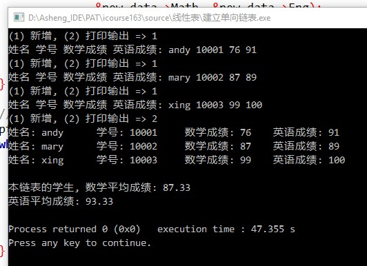

# 基本说明

记录数据结构课程的学习内容.

课程名称: 数据结构  
主讲: 陈越、何钦铭  
网址:  
http://www.icourse163.org/learn/ZJU-93001  

# 1 基本概念

## 1.1 什么是数据结构

问题: 给定一个参数, 遍历打印1-N ?

递归C语言实现:

```c
#include <stdio.h>

void printN (int N);

int main() {
    int N = 60000;
    printN(N);

    printf("\n");
    system("pause");
    return(0);
}

void printN (int N) {
    if (N) {
        printN(N - 1);
        printf("%d\n", N);
    }
    return;
}
```

经测试6万不爆, 6万以上爆掉.

递归, JavaScript语言实现.

```js
function printN (N) {
    if (N) {
        printN(N - 1);
        console.log(N);
    }
}

var N = 30000;
printN(N);
```

经测试, 3万以上爆掉.

### 1.1.3 关于算法的效率 - 计算多项式值

clock(): 捕捉从程序开始运行到clock()被调用时所耗费的时间.  
这个时间单位是clock tick, 即"时钟打点".  

常数CLK_TCK: 机器时钟每秒所走的时钟打点数. 如下, 可打印CLK_TCK常数.  

```c
#include <stdio.h>
#include <time.h> // 使用clock()函数需要引入

int main() {
    printf("%d", CLK_TCK); // 1000(小新笔记本)

    printf("\n");
    system("pause");
    return(0);
}
```

C语言中计算算法时间效率的模板.  

```c
#include <stdio.h>
#include <time.h>
clock_t start, stop;
/* clock_t 是clock()型 函数返回的变量类型 */
double duration;
/* 记录被测函数运行时间，以秒为单位 */
int main () {
    /* 不在测试范围内的准备工作写在clock() 调用之前 */
    start = clock(); /* 开始计时 */
    MyFunction(); /* 把被测函数加在这里 */
    stop = clock(); /* 停止计时 */
    duration = ((double)(stop - start)) / CLK_TCK; /* 计算运行时间 */
    /* 其他不在测试范围的处理写在后面, 例如输出duration的值 */

    printf("\n");
    system("pause");
    return 0;
}
```

计算多项式测试用例:

```c
#include <stdio.h>
#include <time.h>
#include <math.h>

#define MAXK 1e7 /* 被测函数最大重复调用次数 */
clock_t start, stop;
double duration;
#define MAXN 10 /* 多项式最大项数 */
double f1( int n, double a[], double x );
double f2( int n, double a[], double x );

int main () {
    int i;
    double a[MAXN]; /* 存储多项式的系数 */
    for ( i=0; i<MAXN; i++ ) a[i] = (double)i;
    start = clock();
    for (i=0; i<MAXK; i++) {
        f1(MAXN-1, a, 1.1);
    }
    f1(MAXN-1, a, 1.1);
    stop = clock();
    duration = ((double)(stop - start))/CLK_TCK;
    printf("ticks1 = %f\n", (double)(stop - start));
    printf("duration1 = %.4f秒\n", duration);

    start = clock();
    for (i=0; i<MAXK; i++) {
        f2(MAXN-1, a, 1.1);
    }
    stop = clock();
    duration = ((double)(stop - start)) / CLK_TCK;
    printf("ticks2 = %f\n", (double)(stop - start));
    printf("duration2 = %.4f秒\n ", duration);
    return 0;
}

double f1( int n, double a[], double x ) {
    int i;
    double p = a[0];
    for ( i=1; i<=n; i++ )
    p += (a[i] * pow(x, i));
    return p;
}

double f2( int n, double a[], double x ) {
    int i;
    double p = a[n];
    for ( i=n; i>0; i-- )
    p = a[i-1] + x*p;
    return p;
}
/*  
    输出(2017年9月24日08:57:23)
    ticks1 = 8856.000000
    duration1 = 8.8560秒
    ticks2 = 529.000000
    duration2 = 0.5290秒
*/
```

## 1.2 什么是算法

算法(Algorithm)
* 一个有限指令集
* 接受一些输入(有些情况下不需要输入)
* 产生输出
* 一定在有限步骤之后终止
* 每一条指令必须
    * 有充分明确的目标，不可以有歧义
    * 计算机能处理的范围之内
    * 描述应不依赖于任何一种计算机语言以及具体的实现手段

什么是好的算法?  
空间复杂度S(n) —— 根据算法写成的程序在执行时 根据算法写成的程序在执行时  
占用存储单元的长度。这个长度往往与输入数据的规模有关。空间复杂度过高的算  
法可能导致使用的内存超限，造成程序非正常中断。  

时间复杂度T(n) —— 根据算法写成的程序在执行时 根据算法写成的程序在执行时  
耗费时间的长度。这个长度往往也与输入数据的规模有关。时间复杂度过高的低效  
算法可能导致我们在有生之年都等不到运行结果。  

## 1.3 应用实例: 最大子列和问题

```c
#include <stdio.h>

int main () {
    int K; // 一共K个整数
    int List[100000];
    int ThisSum = 0;
    int MaxSum = 0;
    int i;

    scanf("%d", &K);
    for (i=0; i<K; i++) {
        scanf("%d", &List[i]);
    }

    for (i=0; i<K; i++) {
        ThisSum += List[i];
        if (ThisSum > MaxSum) {
            MaxSum = ThisSum;
        } else if (ThisSum < 0) {
            ThisSum = 0;
        }
    }
    printf("%d", MaxSum);

    return 0;
}

// -2 11 -4 13 -5 -2
// { 11, -4, 13 }有最大的和20
```

# 03 线性结构

## 3.1 线性表的顺序存储实现

### 3.1.1 熟悉指针操作结构体

```c
#include <stdio.h>

#define ERROR -1 // 错误信息标志
#define MAXSIZE 20

typedef int ElementType;

struct ListNode {
    ElementType Data[MAXSIZE];
    int length; // 线性表的长度
};
typedef struct ListNode List;
typedef struct ListNode *PtrToList; // 后续函数传参, 传的就是指针

PtrToList MakeEmpty (); // 函数声明


int main() {
    PtrToList PtrDemo; // PtrDemo是指向结构体的指针变量

    PtrDemo = MakeEmpty();
    PtrDemo->length = 200;
    printf("%d\n", PtrDemo->length);

    return 0;
}

// 1. 初始化
PtrToList MakeEmpty () {
    PtrToList L;
    L = (PtrToList)malloc(sizeof(List));
    L->length = 0;
    return L;
}

```

### 3.1.2 完整实现代码

```c
#include <stdio.h>

#define false 0
#define true 1
#define MAXSIZE 20

typedef int bool;
typedef int ElementType;

struct ListNode {
    ElementType Data[MAXSIZE];
    int length; // 线性表的长度
};
typedef struct ListNode List;
typedef struct ListNode *PtrToList; // 后续函数传参, 传的就是指针

PtrToList MakeEmpty (); // 创建空线性表
bool Insert (PtrToList L, ElementType X, int Pos); // 插入
void PrintNodes (PtrToList L); // 打印
int Find (PtrToList L, ElementType X); // 查找
bool Delete (PtrToList L, int Pos); // 删除

int main () {
    PtrToList PtrDemo; // PtrDemo是指向结构体的指针变量

    PtrDemo = MakeEmpty(); // 创建空表
    /* 插入数据测试开始 */
    Insert(PtrDemo, 100, 0);
    Insert(PtrDemo, 10, 1);
    Insert(PtrDemo, 1, 2);
    Insert(PtrDemo, 21, 0);
    PrintNodes(PtrDemo); // 21      100     10      1
    /* 插入数据测试结束 */

    /* 查找测试开始 */
    int Pos; // 存放找到后元素的位置
    int X = 1; // 要查找的元素
    Pos = Find(PtrDemo, X);
    printf("要查找的元素是: %d\n", X);
    printf("位置信息是: %d\n", Pos);

    X = 200;
    Pos = Find(PtrDemo, X);
    printf("要查找的元素是: %d\n", X);
    printf("位置信息是: %d\n", Pos);
    /* 查找测试结束 */

    /* 删除测试开始 */
    printf("\n");
    printf("当前线性表中的元素\n");
    PrintNodes(PtrDemo);
    Delete(PtrDemo, PtrDemo->length - 1); // 删除最后一个元素
    printf("删除最后一个元素\n");
    PrintNodes(PtrDemo);
    /* 删除测试结束 */

    return 0;
}

// 1. 初始化
// 申请一个List需要的空间, 返回一个指向PtrToList的指针
PtrToList MakeEmpty () {
    PtrToList L;
    L = (PtrToList)malloc(sizeof(List));
    L->length = 0;
    return L;
}

// 2. 插入
// Pos的合法位置是 0 ~ L->Length
// 例如 Pos=0, 则代表所有元素都向右移动一格, 把数组0下标空
// 出来, 执行, L->Data[0] = X;
// 成功返回true, 失败返回false
bool Insert (PtrToList L, ElementType X, int Pos) {
    int i;
    if (L->length == MAXSIZE) {
        printf("表空间已满, 不能继续插入\n");
        return false;
    }
    if (Pos < 0 || Pos > L->length) {
        // i的合法取值是 1 ~ L->length - 1
        printf("插入顺序不合法\n");
        return false;
    }
    for (i=L->length; i>=Pos+1; i--) {
        L->Data[i] = L->Data[i-1];
    }
    L->Data[Pos] = X;
    L->length += 1;
    return true;
}

// 3. 打印输出
void PrintNodes (PtrToList L) {
    int i;
    printf("线性表长度: %d\n", L->length);
    printf("线性表数据如下:\n");
    for (i=0; i<L->length; i++) {
        printf("%d\t", L->Data[i]);
    }
    printf("\n");
}

// 4. 查找
// 给定元素值X, 查找其在线性表的位置
// 找到返回位置下标, 找不到返回 -1
int Find (PtrToList L, ElementType X) {
    int i;
    for (i=0; i<L->length; i++) {
        if (L->Data[i] == X) {
            return i;
        }
    }
    return -1;
}

// 5. 删除
// 删除指定位置Pos的元素
// Pos取值范围, [0, L->length-1]
bool Delete (PtrToList L, int Pos) {
    int i;
    if (Pos < 0 || Pos > L->length - 1) {
        printf("删除位置错误\n");
        return false;
    }
    for (i=Pos; i<=L->length; i++) {
        L->Data[i] = L->Data[i + 1];
    }
    L->length--;
    return true;
}

```

## 3.2 线性表的链式存储实现

### 3.2.1 链表简单读取示例

```c
#include <stdio.h>

typedef int elementType;
typedef struct ListNode * PtrNode;
typedef struct ListNode Node;

struct ListNode {
    int data;
    PtrNode next;
};

int main () {
    Node nodeDemo1;
    Node nodeDemo2;
    PtrNode ptrDemo1;
    PtrNode ptrDemo2;

    ptrDemo1 = &nodeDemo1;
    ptrDemo1->next = &nodeDemo2;

    ptrDemo1->data = 100;
    ptrDemo1->next->data = 200;

    printf("%d\n", nodeDemo1.data);
    printf("%d\n", nodeDemo2.data);
    return 0;
}

```

### 3.2.2 malloc分配

```c
#include <stdio.h>

typedef int elementType;
typedef struct ListNode * PtrNode;
typedef struct ListNode Node;

struct ListNode {
    elementType data;
    PtrNode next;
};

int main () {
    PtrNode ptrDemo;
    ptrDemo = (PtrNode)malloc(sizeof(Node));

    ptrDemo->data = 200;

    printf("%d\n", ptrDemo->data); // 200
    return 0;
}
```

### 3.2.3 建立单向链表

问题描述: 用户输入数据来新增学生数据节点, 并建立一个单向链表. 当用户输入  
结束后, 可遍历此链表并显示其内容, 并求出当前链表中所有学生的数学与英语的  
平均成绩.

```c
/*
    建立单向链表: 链表有头指针, 链表末尾是NULL

*/
#include <stdio.h>
#include <stdlib.h>

struct student {
    char name[20];
    int Math;
    int Eng;
    char no[10];
    struct student *next;
};
typedef struct student s_data;


int main () {
    int select = 0; // 用来选择需要进行的操作
    int length = 0; // 学生总数
    float sumMath; // 数学成绩总和
    float sumEng; //英语成绩总和
    s_data *ptr;
    s_data *head;
    s_data *new_data;

    head = (s_data*)malloc(sizeof(s_data));
    head->next = NULL; // 链表初始状态
    ptr = head; // 设置存取指针的位置

    // 增加学生信息
    do {
        printf("(1) 新增, (2) 打印输出 => ");
        scanf("%d", &select);
        if (select != 2) {
            printf("姓名 学号 数学成绩 英语成绩: ");
            new_data = (s_data*)malloc(sizeof(s_data));
            scanf("%s %s %d %d", new_data->name, new_data->no,
                  &new_data->Math, &new_data->Eng);
            ptr->next = new_data;
            new_data->next = NULL;
            ptr = ptr->next;
        }
    } while (select != 2);

    // 遍历学生信息
    ptr = head->next; // 让ptr指向第1个节点
    while (ptr != NULL) {
        printf("姓名: %s\t学号: %s\t数学成绩: %d\t英语成绩: %d\n",
               ptr->name, ptr->no, ptr->Math, ptr->Eng);
        length++;
        sumMath += ptr->Math;
        sumEng += ptr->Eng;
        ptr = ptr->next;
    }

    printf("\n");
    printf("本链表的学生, 数学平均成绩: %4.2f\n", sumMath / length);
    printf("英语平均成绩: %4.2f\n", sumEng / length);
    return 0;
}


```

运行效果截图:



### 3.2.4 单链表完整实现

```c
#include <stdio.h>
#include <stdlib.h>

/* 下面的单链表是带头节点的 */
typedef int elementType;

struct listNode {
    elementType data;
    struct listNode *next;
};
typedef struct listNode list;

// 函数声明
int insert (list *tmp, elementType x, int pos);
void print (list *tmp);
int getLength (list *tmp);
int delete (list *tmp, int pos);

int main () {
    int i;
    list *head = (list*)malloc(sizeof(list));
    head->next = NULL;

    // 循环插入测试数
    for (i=1; i<=10; i++) {
        insert(head, i+2, 1);
    }
    print(head);


    insert(head, 999, 11);
    print(head);

    delete(head, 1); //删除第1个节点
    printf("删除节点后的效果\n");
    print(head);

    return 0;
}

// 插入
// 参数说明: 要插入的链表 插入值 插入位置
// pos的合法取值范围是 [1, length+1]
// 取值为1代表插入到第1个节点之前, 取值为length+1代表插入到表尾
int insert (list *tmp, elementType x, int pos) {
    list *ptr; // 存取指针
    list *cur; // 存放新节点
    int count = 1; // 计数

    int length = getLength(tmp);
    if (pos < 1 || pos > length + 1) {
        printf("插入位置错误\n");
        return -1;
    }

    ptr = tmp; // ptr指向头结点
    while (count < pos) {
        ptr = ptr->next; // 循环结束后ptr指向 pos-1 节点
        count++;
    }
    cur = (list*)malloc(sizeof(list));
    cur->data = x;
    cur->next = ptr->next;
    ptr->next = cur;
    return 0;
}

// 得到链表的长度
int getLength (list *tmp) {
    int length = 0;
    tmp = tmp->next;
    while (tmp != NULL) {
        length++;
        tmp = tmp->next;
    }
    return length;
}

// 循环打印输出链表信息
void print (list *tmp) {
    list *head = tmp;
    tmp = tmp->next;
    printf("链表长度为: %d\n", getLength(head));
    printf("链表中的数据:\n");
    while (tmp != NULL) {
        printf("%d\t", tmp->data);
        tmp = tmp->next;
    }
    printf("\n");
    printf("\n");
}

// 删除
// 删除给定位置上的节点
int delete (list *tmp, int pos) {
    int length = getLength(tmp);
    if (pos < 1 || pos > length) {
        printf("删除位置错误\n");
        return -1;
    }

    int count = 1;
    list *ptr;
    list *posCur; // 存放要删除节点的指针
    ptr = tmp;
    // 找到 pos-1 这个节点
    while (count < pos) {
        ptr = ptr->next;
        count++;
    }
    // 循环结束后 ptr 指向 pos-1 这个节点
    posCur = ptr->next;
    ptr->next = posCur->next;
    free(posCur);
    return 0;
}
```

### 3.2.5 单链表排序(从大到小)

从大到小排序.  
链表带头结点, 链表不动, 只对链表里的值进行排序.

```c
#include <stdio.h>
#include <stdlib.h>
#include <time.h>

struct list {
    int data;
    struct list *next;
};
typedef struct list s_list;
typedef struct list *p_list;

void getRandomList (p_list p, int n); // 为p随机赋n个值
void printList (p_list phead); // 打印phead
void del (p_list p, int pos); // 删除p中第pos个节点
void swap (int *x, int *y); // 交换两个变量的值
int getLength (p_list p); // 得到p的长度
void order (p_list p); // 对p进行排序

int main () {
    int n = 10; // 链表初始值个数
    p_list head = (s_list*)malloc(sizeof(s_list));
    head->next = NULL;

    // 随机赋值
    getRandomList(head, n);
    printList(head);

    order(head);
    printList(head);

    return 0;
}

// 参数: p为链表头结点, n是需要赋值的个数
void getRandomList (p_list p, int n) {
    int i = 0;
    p_list temp;
    srand(time(0));

    while (n) {
        temp = (s_list*)malloc(sizeof(s_list));
        temp->data = rand() % 150 + 1; // data in [1, 150]
        temp->next = p->next;
        p->next = temp;
        n--;
    }
}

// 参数: phead为链表的头结点
void printList (p_list phead) {
    p_list p;
    int length = 0;
    p = phead->next;
    while (p != NULL) {
        printf("%6d", p->data);
        p = p->next;
        length++;
    }
    printf("---Length: %d\n", length);
}

// 删除操作
// 参数: p是要删除链表的头结点, pos是删除的位置
void del (p_list p, int pos) {
    p_list pre = (s_list*)malloc(sizeof(s_list)); // 要删节点的前一个
    p_list cur = (s_list*)malloc(sizeof(s_list)); // 要删的节点
    int count = 1;
    pre = p;

    while (count < pos) {
        pre = pre->next;
        count++;
    }
    cur = pre->next;
    pre->next = cur->next;
    free(cur);
}

void swap (int *x, int *y) {
    int temp;
    temp = *x;
    *x = *y;
    *y = temp;
}

// 对链表进行从大到小排序
// 参数: p要排序的链表
void order (p_list p) {
    p_list temp = (s_list*)malloc(sizeof(s_list));
    int n = getLength(p); // 链表长度
    int i;
    int j;

    /*  假如n=5, 也就是单链表中有5个元素需要排序
        通过分析, 我们需要的是双层循环. 我需要变量像下面这样变化
        i = 4, j = 4
        i = 4, j = 3
        i = 4, j = 2
        i = 4, j = 1

        i = 3, j = 3
        i = 3, j = 2
        i = 3, j = 1

        i = 2, j = 2
        i = 2, j = 1

        i = 1, j = 1
        我下面的循环, 就是为了实现如上所述的效果.
    */
    n = n - 1;
    for (i=n; i>=1; i--) {
        temp = p->next;
        for (j=i; j>=1; j--) {
            // printf("i = %d, j = %d\n", i ,j);
            if (temp->data < temp->next->data) {
                swap(&temp->data, &temp->next->data);
            }
            temp = temp->next;
        }
    }
}

int getLength (p_list p) {
    p_list temp = (s_list*)malloc(sizeof(s_list));
    int length = 0;
    temp = p->next;
    while (temp) {
        temp = temp->next;
        length++;
    }
    return length;
}
```

## 3.3 堆栈

堆栈的抽象数据类型定义为:  
类型名称: 堆栈(Stack)  
数据对象集: 一个有0个或多个元素的又穷线性表  
操作集: 对与一个具体长度为正整数maxSize的堆栈, 堆栈中元素的类型为elementType,  
堆栈的基本操作主要有:  
(1) ptr_stack(int maxSize): 生成空栈, 其最大长度为maxSize  
(2) int isFull(ptr_stack ptr): 判断栈是否已满, 若栈中元素等于maxSize时返回true,  
否则返回false  
(3) int push(ptr_stack ptr, elementType x): 将元素x压入栈. 若栈已满则返回false,  
否则将元素x压入堆栈顶并返回true  
(4) int pop(ptr_stack ptr): 删除并返回栈顶元素. 若堆栈为空则返回错误信息.  

### 3.3.1 堆栈的数组实现

```c
#include <stdio.h>

#define true 1 // 表示真
#define false 0 // 表示假

typedef int elementType;

struct s_stack {
    elementType *data; // 数据
    int top; // 栈顶指针(栈空指向-1)
    int maxSize; // 堆栈的最大容量
};

typedef struct s_stack stack;
typedef struct s_stack* ptr_stack;

// 函数声明
ptr_stack createStack (int maxSize);
int isFull (ptr_stack ptr);
int push (ptr_stack ptr, elementType x);
void print (ptr_stack ptr);
elementType pop (ptr_stack ptr);

int main () {
    int i;
    ptr_stack p_stack;
    p_stack = createStack(20);

    /* 入栈测试开始 */
    for (i=2; i<30; i+=3) {
        push(p_stack, i);
    }
    print(p_stack);
    /* 入栈测试结束 */

    /* 出栈测试开始 */
    int popValue = pop(p_stack);
    printf("出栈的元素是: %d\n", popValue);
    print(p_stack);
    /* 出栈测试结束 */
    return 0;
}

// 生成空栈
ptr_stack createStack (int maxSize) {
    ptr_stack ptr = (stack*)malloc(sizeof(stack));
    ptr->data = (elementType*)malloc(sizeof(elementType) * maxSize);
    ptr->top = -1; // 栈空时, top = -1
    ptr->maxSize = maxSize;
    return ptr;
}

// 判断栈是否满
int isFull (ptr_stack ptr) {
    if (ptr->top == ptr->maxSize - 1) {
        return true;
    } else {
        return false;
    }
}

// 入栈
int push (ptr_stack ptr, elementType x) {
    if (isFull(ptr)) {
        printf("栈满\n\n");
        return false;
    }

    ptr->top += 1;
    ptr->data[ptr->top] = x;
    return true;
}

// 打印
void print (ptr_stack ptr) {
    int i;
    printf("当前栈的长度: %d\n", ptr->top + 1);
    for (i=0; i<=ptr->top; i++) {
        printf("%d\n", ptr->data[i]);
    }
    printf("\n");
}

// 出栈
// 返回栈顶元素, 并把栈顶指针-1
elementType pop (ptr_stack ptr) {
    // 先判断栈是否为空
    if (ptr->top == -1) {
        printf("栈空\n\n");
        return -888; // -888 是自定义的特殊值, 必须是正常栈元素
        // 不可能取到得值
    }

    ptr->top = ptr->top - 1;
    return ptr->data[ptr->top + 1]; // 返回出栈元素的值
}

```

### 3.3.2 堆栈的链表实现

链表是带头结点的. 每次执行入栈操作, 都是把数据压入第1个节点.

完整代码如下:

```c
#include <stdio.h>

#define true 1;
#define false 0;
typedef int elementType;

struct s_stack {
    elementType data;
    struct s_stack* next;
};

typedef struct s_stack stack;
typedef struct s_stack* ptr_stack;

// 函数声明
ptr_stack createStack ();
void push (ptr_stack ptr, elementType x);
void print (ptr_stack ptr);
elementType pop (ptr_stack ptr);

int main () {
    int i;
    ptr_stack stackHead;
    stackHead = createStack();
    /* 入栈测试开始 */
    for (i=1; i<100; i+=8) {
        push(stackHead, i);
    }
    print(stackHead);
    /* 入栈测试结束 */

    /* 出栈测试开始 */
    // stackHead = createStack();
    elementType popValue = pop(stackHead);
    printf("被弹出的元素的值是: %d\n", popValue);
    print(stackHead);
    /* 出栈测试结束 */

    return 0;
}

// 创建空栈
ptr_stack createStack () {
    ptr_stack ptr;
    ptr = (stack*)malloc(sizeof(stack));
    ptr->next = NULL;
    return ptr;
}

// 入栈
void push (ptr_stack ptr, elementType x) {
    ptr_stack curNode; // 存放当前节点
    curNode = (stack*)malloc(sizeof(stack));
    curNode->data = x;

    curNode->next = ptr->next;
    ptr->next = curNode;
}

// 打印
void print (ptr_stack ptr) {
    int length = 0; // 堆栈链表长度
    ptr = ptr->next;
    printf("堆栈链表的数据如下\n");
    while (ptr != NULL) {
        printf("%d\t", ptr->data);
        length += 1;
        ptr = ptr->next;
    }
    printf("\n");
    printf("堆栈链表的长度是: %d\n", length);
    printf("\n");
}

// 出栈
// 如果栈空返回 false
// 返回被pop的元素的值, 并把该元素从栈中移除
 elementType pop (ptr_stack ptr) {
    if (ptr->next == NULL) {
        printf("栈空不能出栈\n");
        return false;
    }

    ptr_stack curNode; // 指向弹出元素
    int curValue; // 保存弹出元素的值

    curNode = ptr->next;
    ptr->next = ptr->next->next;
    curValue = curNode->data;
    free(curNode);

    return curValue;
}
```

### 3.3.3 堆栈的应用 - 老鼠走迷宫问题

```c
#include <stdio.h>
#include <stdlib.h>

/*
    所用的堆栈是链表形式, 并且带有头结点, 整个迷宫地图有4种状态,
    0通路 1走过的路 2墙壁 3已经走过并确认为错误路径
*/

// 老鼠的移动始终遵循 上右下左 规律
// MAZE是迷宫数组
#define UP MAZE[x-1][y]     // 上
#define RIGHT MAZE[x][y+1]  // 右
#define DOWN MAZE[x+1][y]   // 下
#define LEFT MAZE[x][y-1]   // 左
#define EX 2    // 出口x坐标
#define EY 3    // 出口y坐标
#define MAZEX 10 // 迷宫竖向长度
#define MAZEY 12 // 迷宫横向长度

struct list {
    int x;
    int y;
    struct list* next;
};

typedef struct list node;
typedef struct list* link;

// 定义迷宫数组 0通路 1走过的路 2墙壁 3已经走过并确认为错误路径
/* 测试地图1 4x4
int MAZE[MAZEX][MAZEY] = {
    2, 2, 2, 2,
    2, 0, 0, 2,
    2, 0, 0, 0,
    2, 2, 2, 2
};
*/
// 测试地图 2 5x5
/*
int MAZE[MAZEX][MAZEY] = {
    2, 2, 2, 2, 2,
    2, 0, 0, 2, 2,
    2, 0, 2, 0, 2,
    2, 0, 0, 0, 2,
    2, 2, 2, 0, 2
};
*/
// 测试地图 3 10x12
int MAZE[MAZEX][MAZEY] = {
    2, 2, 2, 2, 2, 2, 2, 2, 2, 2, 2, 2,
    2, 0, 2, 2, 0, 0, 0, 2, 2, 2, 2, 2,
    2, 0, 0, 0, 0, 2, 2, 2, 2, 2, 2, 2,
    2, 0, 2, 2, 2, 2, 2, 2, 2, 2, 2, 2,
    2, 0, 0, 0, 2, 2, 2, 2, 2, 2, 2, 2,
    2, 0, 2, 0, 2, 2, 2, 2, 2, 2, 2, 2,
    2, 0, 2, 0, 2, 2, 2, 2, 2, 2, 2, 2,
    2, 0, 0, 0, 2, 2, 2, 2, 2, 2, 2, 2,
    2, 0, 2, 2, 2, 2, 2, 2, 2, 2, 2, 2,
    2, 0, 2, 2, 2, 2, 2, 2, 2, 2, 2, 2
};

// 函数声明
void push (link head, int x, int y);
int pop (link head, int* x, int* y);
int isExit (int x, int y);
void printMaze ();
void printStack (link stack);

int main () {
    int i;
    int j;
    int x = 1; // 老鼠当前位置, 初始状态表示入口x坐标
    int y = 1; // 老鼠当前位置, 初始状态表示入口y坐标

    // 栈的初始化
    link pathHead = (node*)malloc(sizeof(node));
    pathHead->next = NULL;

    // 打印迷宫路径图
    printf("0通路 1走过的路 2墙壁 3已经走过并确认为错误路径\n");
    printf("初始迷宫地图: \n");
    printMaze();

    // 0通路 1走过的路 2墙壁 3已经走过并确认为错误路径
    MAZE[x][y] = 1; // 初始点标记为1
    push(pathHead, x, y); // 首先把初始点压入栈中存放
    while (isExit(x, y) == 0) {
        printf("老鼠现在的位置: %d, %d\n", x, y);
        if (UP == 0) {
            x--;
            MAZE[x][y] = 1; // 走过的路径标记为1
            push(pathHead, x, y);
        } else if (RIGHT == 0) {
            y++;
            MAZE[x][y] = 1; // 走过的路径标记为1
            push(pathHead, x, y);
        } else if (DOWN == 0) {
            x++;
            MAZE[x][y] = 1; // 走过的路径标记为1
            push(pathHead, x, y);
        } else if (LEFT == 0) {
            y--;
            MAZE[x][y] = 1; // 走过的路径标记为1
            push(pathHead, x, y);
        } else {
            printf("当前位置上下左右都不通, 回退!\n");
            pop(pathHead, &x, &y); // 把当前的坐标也就错误坐标, 弹出去
            MAZE[x][y] = 3; // 标记当前死路为3

            // 让x和y回到上一次的位置
            x = pathHead->next->x;
            y = pathHead->next->y;
        }
    }

    printf("老鼠走过的路径如下\n");
    printMaze();
    return 0;
}

// 入栈
void push (link head, int x, int y) {
    link newNode = (node*)malloc(sizeof(node));
    newNode->x = x;
    newNode->y = y;

    newNode->next = head->next;
    head->next = newNode;
}

// 出栈
// 运行结果: 直接对当前x和y的位置进行修改
int pop (link head, int* x, int* y) {
    if (head->next == NULL) {
        printf("栈空\n");
        return 0;
    }

    link popNode = head->next;
    head->next = popNode->next;
    *x = popNode->x;
    *y = popNode->y;
    free(popNode);
    return 1;
}

// 检查是否已经走到出口
// 参数: x 当前x坐标, y当前y坐标
// 返回值: 到出口返回1 ,不在出口返回0
int isExit (int x, int y) {
    // 检查当前位置的上右下左4个位置, 是否已经超出迷宫范围
    // 即可判断, 当前位置是否是出口
    // 也就是说如果当前位置是出口, 当前的位置一定是在迷宫边界上
    if (x <= 0 || x > MAZEX - 1 || y <= 0 || y >= MAZEY - 1) {
        printf("成功找到出口\n");
        printf("\n");
        return 1;
    } else {
        printf("还没找到出口\n");
        printf("\n");
        return 0;
    }
}

// 打印迷宫数组
void printMaze () {
    int i;
    int j;
    for (i=0; i<MAZEX; i++) {
        for (j=0; j<MAZEY; j++) {
			printf("%2d", MAZE[i][j]);
        }
        printf("\n");
    }
    printf("\n");
    printf("\n");
}

// 打印堆栈
void printStack (link stack) {
    int length = 0;
    stack = stack->next;
    while (stack) {
        printf("%d\t%d\n", stack->x, stack->y);
        length += 1;
        stack = stack->next;
    }
    printf("当前一共存储了%d个路径\n", length);
    printf("\n");
}

```

## 3.4 队列

队列的抽象数据类型定义为:  
类型名称: 队列(Queue)  
数据对象集: 一个有一个或多个的又穷线性表  
操作集:  
(1) createQueue(maxSize): 生成空队列, 其最大长度为maxSize  
(2) isFull(queue): 判断队列queue是否已满. 若是返回true, 否则返回false  
(3) isEmpty(queue): 判断队列queue是否为空. 若是返回true, 否则返回false  
(4) add(queue, x): 将元素x入队. 若队列已满, 返回false, 正确入队返回true  
(5) delete(queue): 出队. 删除并返回队列头元素(第一个). 若队列为空返回错误信息.  

### 3.4.1 队列-顺序存储-简单实现

队列最简单的表示方法是用数组. 为了实现正确判断队列空和队列满两种情况, 我们需要2个指针,  
front(指向第一个元素的前一个元素), rear(指向最后一个元素).  
在初始情况下, front和rear都等于-1, 每入队一个元素rear都加1, 当rear=maxSize-1时,  
即队列已满.  每出队一个元素, front+1

完整代码实现如下:

```c
#include <stdio.h>
#include <stdlib.h>

struct queue {
    int* data;
    int front;
    int rear;
    int maxSize;
};
typedef struct queue node;
typedef struct queue* link;

// 函数声明
link createQueue (int maxSize);
void printQueue (link q);
int isFull (link q);
int isEmpty (link q);
int add (link q, int x);
int del (link q);

int main () {
    int i;
    int maxSize = 20;
    link qhead = createQueue(maxSize);

    // 初始队列信息
    printQueue(qhead);

    // 入队测试
    for (i=1; i<=10; i++) {
        add(qhead, i * 2);
    }
    printQueue(qhead);

    // 出队测试
    del(qhead);
    del(qhead);
    del(qhead);
    printQueue(qhead);


    return 0;
}

// 创建空队列
link createQueue (int maxSize) {
    link q;
    q = (node*)malloc(sizeof(node));
    q->data = (int*)malloc(sizeof(int) * maxSize);
    q->front = -1;
    q->rear = -1;
    q->maxSize = maxSize;
    return q;
}

// 打印
void printQueue (link q) {
    int i;
    printf("当前队列的信息如下: \n");
    printf("front = %d\n", q->front);
    printf("rear = %d\n", q->rear);
    printf("maxSize = %d\n", q->maxSize);

    // 打印队列中的数据
    if (isEmpty(q)) {
        printf("当前队列中没有数据\n");
    } else {
        printf("队列中的数据如下: \n");
        // 打印队列, 要根据front和rear来遍历
        for (i=q->front+1; i<=q->rear; i++) {
            printf("%d %d\n", i, q->data[i]);
        }
    }
    printf("\n");
}

// 判断队列是否已满
// 是返回1, 否返回0
int isFull (link q) {
    if (q->rear == q->maxSize - 1) {
        return 1;
    } else {
        return 0;
    }
}

// 判断队列是否为空
// 是返回1, 否返回0
int isEmpty (link q) {
    // 两种判断方法, 一种是front=-1为空, 也可以front=rear
    // 原理一样
    if (q->rear == q->front) {
        return 1;
    } else {
        return 0;
    }
}

// 入队
int add (link q, int x) {
    if (isFull(q)) {
        printf("队列已满, 不能入队\n");
        return 0;
    }
    q->rear += 1;
    q->data[q->rear] = x;
    return 1;
}

// 出队
// 错误返回0, 正确返回被出队元素的值
int del (link q) {
    if (isEmpty(q)) {
        printf("队列为空, 不能出队\n");
        return 0;
    }

    q->front += 1;
    return q->data[q->front];
}

```

### 3.4.2 循环队列-数组实现

循环队列是指, 队尾指针走到末尾后, 还可以继续从头开始走.  

front指针仍然是指向第一个元素的前一个元素, rear指针指向最后一个元素.  
下面我们重点讨论一下循环队列如何判断空和满的问题?  
我下面判断队列空和满是直接根据`q->length`属性来判断, 当`q->length`为0,  
表示队列为空, 当`q->length = maxSize - 1`时, 队列为满. 由于遍历上的原因,  
队列的最大长度只能是数组最大长度-1. 

完整代码如下:

```c
#include <stdio.h>
#include <stdlib.h>

struct queue {
    int* data;
    int front;
    int rear;
    int maxSize;
    int length;
};
typedef struct queue node;
typedef struct queue* link;

// 函数声明
link createQueue (int maxSize);
void printQueue (link q);
int add (link q, int x);
int del (link q);

int main () {
    int i;
    int maxSize = 10; // 队列的最大长度
    link qhead = createQueue(maxSize);

    // 初始队列信息
    printQueue(qhead);

    // 基本入队测试
    for (i=1; i<=10; i++) {
        add(qhead, i * 2);
    }
    printQueue(qhead);

    // 基本出队测试
    del(qhead);
    del(qhead);
    del(qhead);
    del(qhead);
    printQueue(qhead);

    // 循环入队测试
    add(qhead, 100);
    add(qhead, 200);
    add(qhead, 300);
    add(qhead, 400);
    add(qhead, 500);

    printQueue(qhead);
    return 0;
}

// 创建空队列
link createQueue (int maxSize) {
    link q;
    q = (node*)malloc(sizeof(node));
    q->data = (int*)malloc(sizeof(int) * maxSize);
    q->front = -1;
    q->rear = -1;
    q->length = 0;
    q->maxSize = maxSize;
    return q;
}

// 打印
void printQueue (link q) {
    int i;
    printf("当前队列的信息如下: \n");
    printf("front = %d\n", q->front);
    printf("rear = %d\n", q->rear);
    printf("length = %d\n", q->length);
    printf("maxSize = %d\n", q->maxSize);

    // 打印队列中的数据
    if (q->length == 0) {
        printf("当前队列中没有数据\n");
    } else {
        printf("队列中的数据如下: \n");
        i = q->front;
        while (i != q->rear) {
            i = (i + 1) % q->maxSize;
            printf("%d %d\n", i, q->data[i]);
        }
    }
    printf("\n");
}

// 入队
int add (link q, int x) {
    if (q->length == q->maxSize -1 ) {
        printf("队列已满, 不能入队\n");
        return 0;
    }
    q->rear = (q->rear + 1) % q->maxSize;
    q->data[q->rear] = x;
    q->length++;
    return 1;
}

// 出队
// 错误返回0, 正确返回被出队元素的值
int del (link q) {
    if (q->length == 0) {
        printf("队列为空, 不能出队\n");
        return 0;
    }

    q->front = (q->front + 1) % q->maxSize;
    q->length--;
    return q->data[q->front];
}
```

### 3.4.3 队列-链表实现

队列的链表实现和队列的数组实现相比区别还是很大的.  
首先我们需要2个指针`front`和`rear`, 分别指向头节点和尾节点.  
这两个指针不属于节点本身的数据, 因此我们把这个两个指针单独定义成一个结构体.  
因此, 队列的链表实现一共需要2个结构体, 一个存储队列数据本身, 一个存储头和尾指针.  

在`createQueue()`初始化函数中, 让`front`指针指向`NULL`, 通过front指针已经足够  
判断队列为空的情况, 注意这里不能初始化`rear`指针也等于`NULL`, 否则再指向入队操作  
时就会出现问题.  

在入队函数`add()`中, 首先根据`front`指针是否等于`NULL`来判断队列是否是初次插入元素.

在出队函数`del()`中, 先判断队列是否为空.

C语言完整代码实现如下:

```c
#include <stdio.h>
#include <stdlib.h>

struct queue {
    int data;
    struct queue* next;
};
struct queuePointer {
    struct queue* front;
    struct queue* rear;
};
typedef struct queue node;
typedef struct queue* link;
typedef struct queuePointer pnode;
typedef struct queuePointer* pointer;

// 函数声明
pointer createQueue (pointer p);
void add (pointer p, int x);
int del (pointer p);
void print (pointer p);

int main () {

    /* 简单测试开始 */
    pointer qptr = createQueue(qptr);
    add(qptr, 100);
    add(qptr, 200);
    add(qptr, 300);
    printf("%d\n", qptr->front->data); // 100
    printf("%d\n", qptr->rear->data);  // 300
    printf("%d\n", del(qptr)); // 100
    printf("%d\n", qptr->rear->data); // 300
    printf("\n");
    /* 简单测试结束 */

    /*复杂测试开始*/
    int i;
    pointer qptr2 = createQueue(qptr);
    for (i=2; i<=20; i+=2) {
        add(qptr2, i);
    }
    print(qptr2);

    del(qptr2);
    del(qptr2);
    del(qptr2);
    print(qptr2);
    /*复杂测试结束*/

    /* 对头队尾指向同一个节点测试开始 */
    pointer qptr3 = createQueue(qptr);
    add(qptr3, 666);
    del(qptr3);
    add(qptr3, 999);
    print(qptr3);
    /* 对头队尾指向同一个节点测试结束 */
    return 0;
}

// 创建空队列
pointer createQueue (pointer p) {
    p = (pnode*)malloc(sizeof(pnode)); // 这步非常关键, 注意我们使用了嵌套结构体
    p->front = (node*)malloc(sizeof(node));
    p->rear = (node*)malloc(sizeof(node));
    p->front = NULL;
    return p;
}

// 入队
void add (pointer p, int x) {
    link tmp = (node*)malloc(sizeof(node));
    tmp->data = x;
    tmp->next = NULL;

    // 如果这时队列中只有一个元素
    if (p->front == NULL) {
        p->front = tmp;
    }

    p->rear->next = tmp;
    p->rear = tmp;
}

// 出队
// 返回头结点元素的值
int del (pointer p) {
    if (p->front == NULL) {
        printf("队列元素为空, 无法出队\n");
        return 0; // 0表示错误信息
    }
    link tmp = p->front;
    int tmpValue = p->front->data;
    p->front = p->front->next;
    free(tmp);
    return tmpValue;
}

// 打印
void print (pointer p) {
    int length = 0;
    link head = p->front; // 不能直接修改p->front来遍历
    if (head == NULL) {
        printf("当前队列信息为空\n");
    } else {
        printf("当前队列的信息如下: \n");
        while (head) {
            printf("%d\n", head->data);
            head = head->next;
            length++;
        }
        printf("p->front->data = %d\n", p->front->data);
        printf("p->rear->data = %d\n", p->rear->data);
        printf("队列的总长度为: %d\n", length);
    }
    printf("\n\n");
}

```

# 04 查找

## 4.1 顺序查找-带哨兵查找

下面的顺序查找算法采用了倒序查找的方式, 以保持程序的一致性. 就是把数组下标为0的,  
元素空下来, 不存放具体的元素, 而是存放要查找的元素. 这样在查找的过程中, 采用倒序  
遍历的方式, 即从数组最后一个元素开始一直遍历到第0个数组元素.

```c
#include <stdio.h>
#include <stdlib.h>

void print (int arr[], int length);
int orderSearch (int arr[], int val, int max);

int main() {
    int i;
    int max = 21; // 数组最大容量
    int data[max];
    int search; // 要查找的值
    int pos; // 要查找的元素在数组中的位置

    // 为数组赋值max个范围在[1, 150]的随机数
    for (i=1; i<max; i++) {
        // 数组的下标0不用来存储数据
        data[i] = rand() % 150 + 1;
    }
    printf("清输入要查找的值, 取值范围是[1, 150]: \n");
    scanf("%d", &search);
    pos = orderSearch(data, search, max);
    if (pos) {
        printf("查找成功, %d %d\n", pos, data[pos]);
    } else {
        printf("查找失败, 数组中没有这个元素\n");
    }

    print(data, max);
	return 0;
}

void print (int arr[], int length) {
    printf("\n");
    printf("数组内的全部元素如下: \n");
    int i;
    for (i=0; i<length; i++) {
        printf("%d %d\n", i, arr[i]);
    }
    printf("\n");
}

// 参数: arr查找数组 val查找值 max数组容量
int orderSearch (int arr[], int val, int max) {
    arr[0] = val;
    max--;
    while (max != -1) {
        if (arr[max] == val) {
            return max;
        }
        max--;
    }
}

```

## 4.2 二分查找(折半查找)

数据元素采用数组方式存储, 并且按照从小到大的顺序存储.  
下标0不存放元素, 从下标1开始存放元素, 元素值的范围在[1, 150].  

```c
#include <stdio.h>

void print (int arr[], int length);
int binarySearch (int arr[], int val, int max);

int main () {
    int max = 11;
    int arr[11] = {0, 1, 16, 24, 35, 47, 59, 62, 73, 88, 99};
    int pos;

    print(arr, max);

    pos = binarySearch(arr, 88, max); // 查找88, 在数组中的位置
    if (pos) {
        printf("查找成功\n");
        printf("%d %d\n", pos, arr[pos]);
    } else {
        printf("查找失败\n");
    }

	return 0;
}

void print (int arr[], int length) {
    printf("\n");
    printf("数组内的全部元素如下: \n");
    int i;
    for (i=0; i<length; i++) {
        printf("%d %d\n", i, arr[i]);
    }
    printf("\n");
}

// 参数: arr查找数组 val查找值 max数组容量
// 返回值: 找到返回元素在数组中的下标, 找不到返回0
int binarySearch (int arr[], int val, int max) {
    int left = 1; // 存放第一个元素的下标
    int right = max - 1; // 数组最后一个元素的下标
    int pos = 0;
    int mid;

    while (left <= right) {
        mid = (int)((left + right) / 2);
        printf("mid: %d\n", mid);
        if (arr[mid] > val) {
            right = mid - 1;
        } else if (arr[mid] < val) {
            left = mid + 1;
        } else {
            pos = mid;
            break;
        }
    }

    return pos;
}

```

# 05 排序

在排序过程中, 数据的移动方式分为两种: 直接移动和逻辑移动. 直接移动是指直接交换存储  
数据的位置, 逻辑移动是指改变指针的指向.  

排序可分为内部排序和外部排序. 数量较小, 可一次性全部加载到RAM称为内部排序, 数据量  
太大, 需要借助硬盘等辅助存储器进行排序, 称为外部排序.  

排序分为**稳定排序**和**不稳定排序**. 未排序前A在B前, 排序后A仍在B前则称为稳定排序,  
否则如果有可能使排序后B在A前, 称为不稳定排序.

内部排序法有:
- 冒泡排序
- 选择排序
- 插入排序
- 希尔排序
- 合并排序
- 快速排序
- 堆积排序
- 基数排序
- 归并排序

需要用的函数如下:

```c
#include <stdio.h>
#include <stdlib.h>
#include <time.h>

void getRandomArr (int arr[], int n);
void printArr (int arr[], int n);
void swap (int arr[], int i, int j);

int main () {
    int max = 10;
    int sortArr[max];
    getRandomArr(sortArr, max);

    printf("当前创建的随机数据如下: \n");
    printArr(sortArr, max);

    printf("交换数组2和5, 之后: \n");
    swap(sortArr, 2, 5);
    printArr(sortArr, max);
    return 0;
}

// 函数功能: 对主程序中的数组进行, 随机数赋值
// 参数: arr[] 主程序数组名称, n 数组大小
void getRandomArr (int arr[], int n) {
    int i;
    arr[0] = 0; // 默认0号下标, 值为0
    srand(time(0)); // 随机数种子
    for (i=1; i<n; i++) {
        arr[i] = rand() % 150 + 1; // 范围[1, 150]
    }
}

// 函数功能: 打印数组
// 参数: arr[] 需要打印的数组, n 数组大小
void printArr (int arr[], int n) {
    int i;
    for (i=0; i<n; i++) {
        printf("arr[%d]: %d\n", i, arr[i]);
    }
}

// 函数功能: 交换数组i和j下标的2个元素
void swap (int arr[], int i, int j) {
    int tmp = arr[i];
    arr[i] = arr[j];
    arr[j] = tmp;
}

```


## 5.1 简单交换排序

输入: 待排序的整型数组, 输出: 排序完毕的整型数组.  
排序方法: 按照从小到大排序.  
数组下标0, 不存放元素, 用作哨兵或其它用途.  

给出数组`arr = {0, 9, 2, 4, 1}`, arr[0]是哨兵, 我们先不看.
实现思路:  
arr[1]和arr[2], arr[3], arr[4]分别比较
发现arr[1] > arr[2], 把arr[1]和arr[2]交换
现在数组变成这样 `arr = {0, 2, 9, 4, 1}`
这时arr[1]已经等于2, 继续arr[1]和arr[3]比较, 也就是2和4比较
2比4小, 继续比较arr[1]和arr[4], arr[1] > arr[4], 交换arr[1]和arr[4],  
这时数组已经变成这样 `arr = {0, 1, 9, 4, 2}`, 继续上述过程直到数组有序.  

完整实现如下: 

```c
#include <stdio.h>
#include <stdlib.h>
#include <time.h>

void getRandomArr (int arr[], int n);
void printArr (int arr[], int n);
void swap (int arr[], int i, int j);
void swapSort (int arr[], int n);

int main () {
    int max = 10; // 数组长度
    int sortArr[max]; // 待排序数组
    getRandomArr(sortArr, max); // 为待排序数组, 赋值
    printf("待排序的元素如下: \n");
    printArr(sortArr, max);

    printf("排序完毕的元素如下(从小到大): \n");
    swapSort(sortArr, max);
    printArr(sortArr, max);
    return 0;
}

// 函数功能: 对主程序中的数组进行, 随机数赋值
// 参数: arr[] 主程序数组名称, n 数组大小
void getRandomArr (int arr[], int n) {
    int i;
    arr[0] = 0; // 默认0号下标, 值为0
    srand(time(0)); // 随机数种子
    for (i=1; i<n; i++) {
        arr[i] = rand() % 150 + 1; // 范围[1, 150]
    }
}

// 函数功能: 打印数组
// 参数: arr[] 需要打印的数组, n 数组大小
void printArr (int arr[], int n) {
    int i;
    for (i=0; i<n; i++) {
        printf("arr[%d]: %d\n", i, arr[i]);
    }
    printf("\n");
}

// 函数功能: 交换数组i和j下标的2个元素
void swap (int arr[], int i, int j) {
    int tmp = arr[i];
    arr[i] = arr[j];
    arr[j] = tmp;
}

// 函数功能: 完成对arr[]的排序
// 参数: arr[] 待排序的数组, n该数组的长度
void swapSort (int arr[], int n) {
    int i;
    int j;
    for (i=1; i<n; i++) {
        for (j=i+1; j<n; j++) {
            // 每次循环一遍结束后, 第i个位置就是最小值
            if (arr[i] > arr[j]) {
                swap(arr, i, j);
            }
        }
    }
}

```

## 5.2 冒泡排序

输入: 待排序的整型数组, 输出: 排序完毕的整型数组.  
排序方法: 按照从小到大排序.  
数组下标0, 不存放元素, 用作哨兵或其它用途.  

实现思路:  
从数组最后一个元素开始, 与前面一个元素进行两两比较, 如果发现前面的元素  
大于数组后面的元素, 则把该元素交换到上面去.  

举例说明:  
假设数组`arr[5] = {12, 35, 99, 18, 76}`, 我们一共需要4趟冒泡排序.  
第1次, 把5个数中最大的放到最后arr[4]  
第2次, 把前4个数中, 最大的数, 放到arr[3]  
第3次, 把前3个数中, 最大的数, 放到arr[2]  
第4次, 把前2个数中, 最大的数, 放到arr[1], 完成排序.  

现在考虑, 怎么把5个数最大的数放到最后, 答案是两两比较, 只要当前的数比后面的大,  
就把当前的数与其后的数交换, 这样一路到最后, 最后一个数自然就是最大的数.  
具体到代码实现, 首先完成循环需要4趟, 可以让i从[1, 4], (让i从[0, 3]也能实现)  
先在i从[1, 4]分别表示4次循环, 总数`n=5`  
i=1, 第1趟循环, 需要访问5个数, 只需j从[0, 3], 这样使用j和j+1, 就能访问5个数  
i=2, 第2趟循环, 需要访问4个数, 只需j从[0, 2], 这样使用j和j+1, 就能访问4个数  
i=3, 第3趟循环, 需要访问3个数, 只需j从[0, 1], 这样使用j和j+1, 就能访问3个数  
i=4, 第4趟循环, 需要访问2个数, 只需j从[0, 0], 这样使用j和j+1, 就能访问2个数  
也就是, j最大值, `j = n - (i+1)`, 写成代码如下  

    for (i=1; i<=n-1; i++)
        for (j=0; j<=n-(i+1); j++)

### 冒泡排序 - 对数组排序

```c
#include <stdio.h>
#include <stdlib.h>
#include <time.h>

void getRandomArr (int arr[], int n);
void printArr (int arr[], int n);
void swap (int arr[], int i, int j);
void bubbleSort (int arr[], int n);

int main () {
    int max = 10; // 数组长度
    int sortArr[max]; // 待排序数组
    getRandomArr(sortArr, max); // 为待排序数组, 赋值
    printf("待排序的元素如下: \n");
    printArr(sortArr, max);

    printf("排序完毕的元素如下(从小到大): \n");
    bubbleSort(sortArr, max);
    printArr(sortArr, max);
    return 0;
}

// 函数功能: 对主程序中的数组进行, 随机数赋值
// 参数: arr[] 主程序数组名称, n 数组大小
void getRandomArr (int arr[], int n) {
    int i;
    srand(time(0)); // 随机数种子
    for (i=0; i<n; i++) {
        arr[i] = rand() % 150; // 范围[0, 150]
    }
}

// 函数功能: 打印数组
// 参数: arr[] 需要打印的数组, n 数组大小
void printArr (int arr[], int n) {
    int i;
    for (i=0; i<n; i++) {
        printf("arr[%d]: %d\n", i, arr[i]);
    }
    printf("\n");
}

// 函数功能: 交换数组i和j下标的2个元素
void swap (int arr[], int i, int j) {
    int tmp = arr[i];
    arr[i] = arr[j];
    arr[j] = tmp;
}

// 函数功能: 完成对arr[]的排序
// 参数: arr[] 待排序的数组, n该数组的长度
// n个数据, 存在[0, n-1]中
void bubbleSort (int arr[], int n) {
    int i;
    int j;
    int flag; // 1说明已经排好序, 0未排好
    for (i=1; i<=n-1; i++) {
        flag = 1;
        for (j=0; j<=n-(i+1); j++) {
            if (arr[j] > arr[j+1]) {
                swap(arr, j, j+1);
                flag = 0;
            }
        }
        if (flag == 1) {
            break;
        }
    }
}
```

### 冒泡排序 - 从下标0开始

数组下标范围, [0, n-1], 升序排序

```c
// 冒泡排序
void bubbleSort (int arr[], int n) {
    int i;
    int j;
    for (i=n-2; i>=0; i--) {
        for (j=0; j<=i; j++) {
            if (arr[j] > arr[j + 1]) {
                swap(&arr[j], &arr[j + 1]);
            }
        }
    }
}
```

## 5.3 简单选择排序

输入: 待排序的整型数组, 输出: 排序完毕的整型数组.  
排序方法: 按照从小到大排序.  
数组下标0, 不存放元素, 用作哨兵或其它用途.  

实现思路:  
每次循环一次, 把最小的值放在首位.  
例如让第1个值, 分别与后面所有的值比较, 如果发现后面有值比第1个值小,  
则记录下这个位置, 当一次循环完毕后记录的位置就是最小值, 交换记录位置  
的值和当前值.  

完整实现代码如下:

```c
#include <stdio.h>
#include <stdlib.h>
#include <time.h>

void getRandomArr (int arr[], int n);
void printArr (int arr[], int n);
void swap (int arr[], int i, int j);
void selectSort (int arr[], int n);

int main () {
    int max = 10; // 数组长度
    int sortArr[max]; // 待排序数组
    getRandomArr(sortArr, max); // 为待排序数组, 赋值
    printf("待排序的元素如下: \n");
    printArr(sortArr, max);

    printf("排序完毕的元素如下(从小到大): \n");
    selectSort(sortArr, max);
    printArr(sortArr, max);
    return 0;
}

// 函数功能: 对主程序中的数组进行, 随机数赋值
// 参数: arr[] 主程序数组名称, n 数组大小
void getRandomArr (int arr[], int n) {
    int i;
    arr[0] = 0; // 默认0号下标, 值为0
    srand(time(0)); // 随机数种子
    for (i=1; i<n; i++) {
        arr[i] = rand() % 150 + 1; // 范围[1, 150]
    }
}

// 函数功能: 打印数组
// 参数: arr[] 需要打印的数组, n 数组大小
void printArr (int arr[], int n) {
    int i;
    for (i=0; i<n; i++) {
        printf("arr[%d]: %d\n", i, arr[i]);
    }
    printf("\n");
}

// 函数功能: 交换数组i和j下标的2个元素
void swap (int arr[], int i, int j) {
    int tmp = arr[i];
    arr[i] = arr[j];
    arr[j] = tmp;
}

// 函数功能: 完成对arr[]的排序
// 参数: arr[] 待排序的数组, n该数组的长度
void selectSort (int arr[], int n) {
    int i;
    int j;
    int minPos; // 最小值下标
    for (i=1; i<n; i++) {
        minPos = i;
        for (j=i+1; j<n; j++) {
            if (arr[minPos] > arr[j]) {
                minPos = j;
            }
        }

        if (minPos != i) {
            swap(arr, i, minPos);
        }
    }
}
```

## 5.4 简单插入排序

输入: 待排序的整型数组, 输出: 排序完毕的整型数组.  
排序方法: 按照从小到大排序.  
数组下标0, 不存放元素, 用作哨兵或其它用途.  

实现思路:  
把整个数组元素分成2部分, 已排序好的元素和未排序好的元素, 每次把未排序中  
的元素, 拿出一个放在已排序好的元素中恰当的位置, 循环到最后, 即完成排序.  

初始状态, 数组下标1, 也就是第1个元素, 就是已排好序的元素, [2, maxsize],  
这部分数组元素就是未排好序的元素. 第1层循环, i在[2, maxsize-1], 第2层循环,  
就是遍历已排序好的元素,j的范围是[i-1, 1]之间(递减), 之后两两比较并交换即可完成排序.

完整实现代码如下:

```c
#include <stdio.h>
#include <stdlib.h>
#include <time.h>

void getRandomArr (int arr[], int n);
void printArr (int arr[], int n);
void swap (int arr[], int i, int j);
void insertSort (int arr[], int n);

int main () {
    int max = 6; // 数组长度
    int sortArr[max]; // 待排序数组
    getRandomArr(sortArr, max); // 为待排序数组, 赋值
    printf("待排序的元素如下: \n");
    printArr(sortArr, max);

    printf("排序完毕的元素如下(从小到大): \n");
    insertSort(sortArr, max);
    printArr(sortArr, max);
    return 0;
}

// 函数功能: 对主程序中的数组进行, 随机数赋值
// 参数: arr[] 主程序数组名称, n 数组大小
void getRandomArr (int arr[], int n) {
    int i;
    arr[0] = 0; // 默认0号下标, 值为0
    srand(time(0)); // 随机数种子
    for (i=1; i<n; i++) {
        arr[i] = rand() % 150 + 1; // 范围[1, 150]
    }
}

// 函数功能: 打印数组
// 参数: arr[] 需要打印的数组, n 数组大小
void printArr (int arr[], int n) {
    int i;
    for (i=0; i<n; i++) {
        printf("arr[%d]: %d\n", i, arr[i]);
    }
    printf("\n");
}

// 函数功能: 交换数组i和j下标的2个元素
void swap (int arr[], int i, int j) {
    int tmp = arr[i];
    arr[i] = arr[j];
    arr[j] = tmp;
}

// 函数功能: 完成对arr[]的排序
// 参数: arr[] 待排序的数组, n该数组的长度
void insertSort (int arr[], int n) {
    int i;
    int j;
    for (i=2; i<n; i++) {
        // 如果刚开始i > i-1, 则该元素就是本次最大值, 不用移动
        if (arr[i] > arr[i-1]) {
            continue;
        }

        for (j=i-1; j>=1; j--) { // 遍历已经排好序的元素
            // 进行两两比较, 并交换
            if (arr[j+1] < arr[j]) {
                swap(arr, j, j+1);
            }
        }
        // printArr(arr, n);
    }
}
```

### 插入排序升级版

数组下标范围, [0, n-1], 升序排序

```c
void insertionSort (int arr[], int n) {
    int i;
    int j;
    for (i=0; i<n; i++) {
        for (j=i; j>=1; j--) {
            if (arr[j] > arr[j - 1]) break; // 优化
            if (arr[j - 1] > arr[j]) {
                swap(&arr[j - 1], &arr[j]);
            }
        }
    }
}
```

## 5.5 桶排序

input:  5 3 5 2 8
output: 8 5 5 3 2 (从小到大排序) 

限定分数范围是[0, 10]

```c
#include <stdio.h>
#include <stdlib.h>

int main () {
    int arr[11];
    int temp;
    int i;
    int j;

    for (i=0; i<11; i++) {
        arr[i] = 0;
    }

    for (i=1; i<=5; i++) {
        scanf("%d", &temp);
        arr[temp] += 1;
    }

    for (i=10; i>=0; i--) {
        if (arr[i] == 0) continue;
        for (j=1; j<=arr[i]; j++) {
            printf("%d ", i);
        }
    }
    printf("\n");
    return 0;
}

```

## 5.6 归并排序

### 合并

首先解决, 把一个数组中间2部分, 这2部分是, 左边有序, 右边有序,  
(假设是升序), 把这两部分合并成全部有序

```c
#include <stdio.h>

void mergeArray (int arr[], int left, int mid, int right, int temp[]);
void printArr (int arr[], int len);

int main (void) {
    // 测试1
    // int arr[5] = {5, 6, 1, 2, 100};
    // int temp[5];
    // mergeArray(arr, 0, 1, 4, temp);
    // printArr(arr, 5);
    // 1 2 5 6 100

    // 测试2
    // int arr[7] = {21, 36, 5, 6, 1, 2, 100};
    // int temp[7];
    // mergeArray(arr, 2, 3, 5, temp);
    // printArr(arr, 7);
    // 21 36 1 2 5 6 100

    return 0;
}

/*
功能: 把一个左右两部分有序的数组, 变成全部有序
参数:
    arr, 需要合并的数组
    left, 左半部分起点
    mid, 左半部分终点
    right, 右半部分终点
    temp[], 临时数组
*/
void mergeArray (int arr[], int left, int mid, int right, int temp[]) {
    int i = left;
    int m = mid;
    int j = mid + 1;
    int n = right;
    int k = 0;

    // 二路归并
    while (i <= m && j <= n) {
        if (arr[i] <= arr[j]) {
            temp[k++] = arr[i++];
        } else {
            temp[k++] = arr[j++];
        }
    }

    // 处理剩余的元素
    while (i <= m) {
        temp[k++] = arr[i++];
    }
    while (j <= n) {
        temp[k++] = arr[j++];
    }

    // 处理完毕后把临时数组赋给原数组
    for (i=0; i<k; i++) {
        arr[left + i] = temp[i];
    }
}

// 功能: 打印数组
// 参数: arr[], 需要打印的数组, len, 该数组的长度
void printArr (int arr[], int len) {
    int i;
    char ch = ' ';
    for (i=0; i<len; i++) {
        if (i == len-1) ch = '\n';
        printf("%d%c", arr[i], ch);
    }
}

```

### 归并 - 递归实现

```c
#include <stdio.h>

void swap (int *a, int *b);
void mergeArray (int arr[], int left, int mid, int right, int temp[]);
void mergeSort (int arr[], int left, int right, int temp[]);
void printArr (int arr[], int n);

int main (void) {
    int n = 10;
    int arr[10] = {3, 1, 2, 8, 7, 5, 9, 4, 6, 0};
    int temp[10];
    mergeSort(arr, 0, 9, temp);
    printArr(arr, n);
    return 0;
}

// 插入排序
void insertionSort (int arr[], int n) {
    int i;
    int j;
    for (i=0; i<n; i++) {
        for (j=i; j>=1; j--) {
            if (arr[j - 1] > arr[j]) {
                swap(&arr[j - 1], &arr[j]);
            }
        }
    }
}

// 归并排序
void mergeArray (int arr[], int left, int mid, int right, int temp[]) {
    int i = left;
    int j = mid + 1;
    int m = mid;
    int n = right;
    int k = 0;

    // 二路归并
    while (i <= m && j <= n) {
        if (arr[i] <= arr[j]) {
            temp[k++] = arr[i++];
        } else {
            temp[k++] = arr[j++];
        }
    }

    while (i <= m) {
        temp[k++] = arr[i++];
    }
    while (j <= n) {
        temp[k++] = arr[j++];
    }

    for (i=0; i<k; i++) {
        arr[left + i] = temp[i];
    }
}

void mergeSort (int arr[], int left, int right, int temp[]) {
    int mid;
    if (left < right) {
        mid = left + (right - left) / 2;
        mergeSort(arr, left, mid, temp);
        mergeSort(arr, mid + 1, right, temp);
        mergeArray(arr, left, mid, right, temp);
    }
}

// 数据交换
void swap (int *a, int *b) {
    int temp;
    temp = *a;
    *a = *b;
    *b = temp;
}

// 打印
void printArr (int arr[], int n) {
    int i;
    char ch = ' ';
    for (i=0; i<n; i++) {
        if (i == n-1) ch = '\n';
        printf("%d%c", arr[i], ch);
    }
}

```

### 归并 - 迭代实现

```c

```

参考: https://www.cnblogs.com/bluestorm/archive/2012/09/06/2673138.html#undefined

# 06 素数

除了1和自身之外不能整除其它数, 称之为素数. 最小的素数是2. 没有最大的素数.  
1000以内素数, 如下图所示:  


关于素数的算法, 一般有2种.  
第1种, 给出一个数n(n >= 2), 判断n是不是素数  
第2种, 给出一个数n(n >= 2), 把`[2, n]`的所有素数拿出来

判断一个数n是否是素数, 最简单粗暴的方法就是把n分别与i(i的范围是[2, n-1])求余  
稍微想一下我们就能知道, 只需判断n与[2, n/2]求余即可  
再高级点利用数学上的证明, 可以得出, 只需判断n与[2, sqrt(n)]求余即可

> C语言sqrt的原型是: double sqrt(double x)

下面的代码展示了2个利用sqrt(n)就素数的算法, 其中第2个算法通过一些简单的变换, 使
我们不必具体求出sqrt(n)的值, 就能判断n是不是素数

```c
#include <stdio.h>
#include <math.h>

int isPrime1 (int n);
int isPrime2 (int n);

int main () {
    int i;
    // 打印 [2, 1000]内的所有素数
    for (i=2; i<=1000; i++) {
        if (isPrime2(i) == 1) {
            printf("%6d", i);
        }
    }
    return 0;
}

// 判断n是否是素数(利用库函数sqrt(n))
// 返回值: 是返回1, 否返回0
int isPrime1 (int n) {
    int i;
    int flag = 1; // 先假设n就是素数
    int squareRoot = (int)(sqrt(n));
    for (i=2; i<=squareRoot; i++) {
        if (n % i == 0) {
            flag = 0;
            break;
        }
    }
    return flag;
}

// 判断n是否是素数(不使用sqrt())
// 返回值: 是返回1, 否返回0
int isPrime2 (int n) {
    int i = 2;
    int flag = 1;
    while (i * i <= n) {
        if (n % i == 0) {
            flag = 0;
            break;
        }
        i++;
    }
    return flag;
}
```
