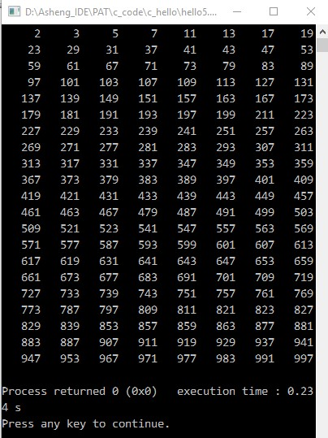

# 01. 素数 

除了1和自身之外不能整除其它数, 称之为素数. 最小的素数是2. 没有最大的素数.  
1000以内素数, 如下图所示:  


关于素数的算法, 一般有2种.  
第1种, 给出一个数n(n >= 2), 判断n是不是素数  
第2种, 给出一个数n(n >= 2), 把`[2, n]`的所有素数拿出来

判断一个数n是否是素数, 最简单粗暴的方法就是把n分别与i(i的范围是[2, n-1])求余  
稍微想一下我们就能知道, 只需判断n与[2, n/2]求余即可  
再高级点利用数学上的证明, 可以得出, 只需判断n与[2, sqrt(n)]求余即可

> C语言sqrt的原型是: double sqrt(double x)

下面的代码展示了2个利用sqrt(n)就素数的算法, 其中第2个算法通过一些简单的变换, 使
我们不必具体求出sqrt(n)的值, 就能判断n是不是素数

```c
#include <stdio.h>
#include <math.h>

int isPrime1 (int n);
int isPrime2 (int n);

int main () {
    int i;
    // 打印 [2, 1000]内的所有素数
    for (i=2; i<=1000; i++) {
        if (isPrime2(i) == 1) {
            printf("%6d", i);
        }
    }
    return 0;
}

// 判断n是否是素数(利用库函数sqrt(n))
// 返回值: 是返回1, 否返回0
int isPrime1 (int n) {
    int i;
    int flag = 1; // 先假设n就是素数
    int squareRoot = (int)(sqrt(n));
    for (i=2; i<=squareRoot; i++) {
        if (n % i == 0) {
            flag = 0;
            break;
        }
    }
    return flag;
}

// 判断n是否是素数(不使用sqrt())
// 返回值: 是返回1, 否返回0
int isPrime2 (int n) {
    int i = 2;
    int flag = 1;
    while (i * i <= n) {
        if (n % i == 0) {
            flag = 0;
            break;
        }
        i++;
    }
    return flag;
}

```

# 02. 进制转换

二, 八, 十, 十六进制转换图解, 参考:  
http://www.cnblogs.com/gaizai/p/4233780.html

## 十进制转二进制

```c
#include <stdio.h>

// 输入: 十进制整数n (n >= 0)
// 输出: 二进制字符串
// 43(10) --> 101011(2)
// 9(10) --> 1001(2)

int getLength (int n);

int main () {
    int int10 = 43;
    char bin2[100];
    char *p;
    int len;

    len = getLength(int10);
    bin2[len] = '\0';
    len = len - 1; // 数组从下标0开始
    while (int10 != 0) {
        bin2[len] = (char)(int10 % 2 + '0');  // 整数转字符
        int10 = (int10 - (int10 % 2)) / 2;
        len = len - 1;
    }
    printf("%s\n", bin2);

    return 0;
}

int getLength (int n) {
    int i = 0;
    while (n != 0) {
        i++;
        n = (n - (n % 2)) / 2;
    }
    return i;
}

```

## 十进制数包含多少个"1"

input: 43
output: 4

比如, 十进制43的二进制是101011, 直接判断`43%2`是否等于0, 不等于0说明43  
末尾是1, 然后作右移运算, 接着继续判断末尾是不是1, 遍历完毕即得出结果.  

```c
#include <stdio.h>

// 43(10) --> 101011(2) 包含4个1
int countOneBits (unsigned n);

int main () {
    int n = 33;
    printf("%d\n", countOneBits(n));
    return 0;
}

int countOneBits (unsigned n) {
    int ones = 0;
    while (n != 0) {
        if (n % 2 != 0) {
            ones = ones + 1;
        }
        n = n >> 1;
    }
    return ones;
}

```

## 两个整数二进制格式有多少个位不同? 

input: 43(10) --> 101011(2)
input: 33(10) --> 100001(2)
output: 2

本题需要用到C语言`^`和`>>`操作符.  
思想非常简单, 我们知道2个2进制数进行, 异或(`^`), 同者为1, 异者为0  
也就是, 异或后的结果中有多个1, 就代表这两个数有多少个位不同. 那么问题  
回到了怎么判断一个数中有多少个1的问题, 利用`>>`操作符, 一位一位的判断.  

```c
#include <stdio.h>

int countOneBits (unsigned n);

int main () {
    int n = 43;
    int m = 33;
    int res = n ^ m;
    printf("%d\n", countOneBits(res));
    return 0;
}

int countOneBits (unsigned n) {
    int ones = 0;
    while (n != 0) {
        if (n % 2 != 0) {
            ones = ones + 1;
        }
        n = n >> 1;
    }
    return ones;
}

```

## 10进制里面有多个0和1

```c
#include <stdio.h>

int main() {

    int n = 27; // (27) => (11011)
    int zero = 0;
    int one = 0;
    while (n != 0) {
        if ((n & 1) == 0) zero++;
        if ((n & 1) == 1) one++;
        n = n >> 1;
    }
    printf("zero: %d \n one: %d", zero, one);
    
    return 0;
}

```

# 03. 自然数

0 1 2 3 4 ...  称为自然数

# 04. 递归和迭代

问题引入: 求x的阶乘x! ? 

## 迭代求阶乘

```c
#include <stdio.h>

int iteration (int x);

int main (void) {
    printf("%d\n", iteration(5));
    return 0;
}

int iteration (int x) {
    int sum = 1;
    int i;
    for (i=1; i<=x; i++) {
        sum = sum * i;
    }
    return sum;
}
```

## 递归求阶乘

```c
#include <stdio.h>

int recursion (int x);

int main (void) {
    printf("%d\n", recursion(5));
    return 0;
}

int recursion (int x) {
    if(x > 1) {
        return x * recursion(x - 1);
    } else {
        return 1;
    }
}
```

迭代和递归实现, 可以互转.

# 05. 封装C语言qsort

## 核心代码

```c
/*
功能: 对给定数组区间进行排序 (闭区间)
参数: 
    arr, 待排序的数组
    start, 起始下标
    end, 终止下标
*/
void mysort (int arr[], int start, int end) {
    int num = end - start + 1;
    qsort(&arr[start], end - start + 1, sizeof(int), compare);
}

int compare (const void *a, const void *b) {
    int arg1 = *(const int*)a;
    int arg2 = *(const int*)b;
    return arg1 - arg2;
}
```

## 完整测试

```c
#include <stdio.h>
#include <stdlib.h>

int compare (const void *a, const void *b);
void printArr (int arr[], int len);
void mysort (int arr[], int start, int end);

int main (void) {
    int len = 10;//0  1  2  3  4  5  6  7  8  9
    int arr[10] = {3, 1, 2, 8, 7, 5, 9, 4, 6, 0};
    mysort(arr, 4, 4);
    printArr(arr, len);
    return 0;
}

/*
功能: 对给定数组区间进行排序 (闭区间)
参数: 
    arr, 待排序的数组
    start, 起始下标
    end, 终止下标
*/
void mysort (int arr[], int start, int end) {
    int num = end - start + 1;
    qsort(&arr[start], end - start + 1, sizeof(int), compare);
}

int compare (const void *a, const void *b) {
    int arg1 = *(const int*)a;
    int arg2 = *(const int*)b;
    return arg1 - arg2;
}

// 打印
void printArr (int arr[], int len) {
    int i;
    char ch = ' ';
    for (i=0; i<len; i++) {
        if (i == len - 1) ch = '\n';
        printf("%d%c", arr[i], ch);
    }
}
```

06. 数的分类

素数: 最小的素数是 2  
自然数: 最小的自然数是 0  
